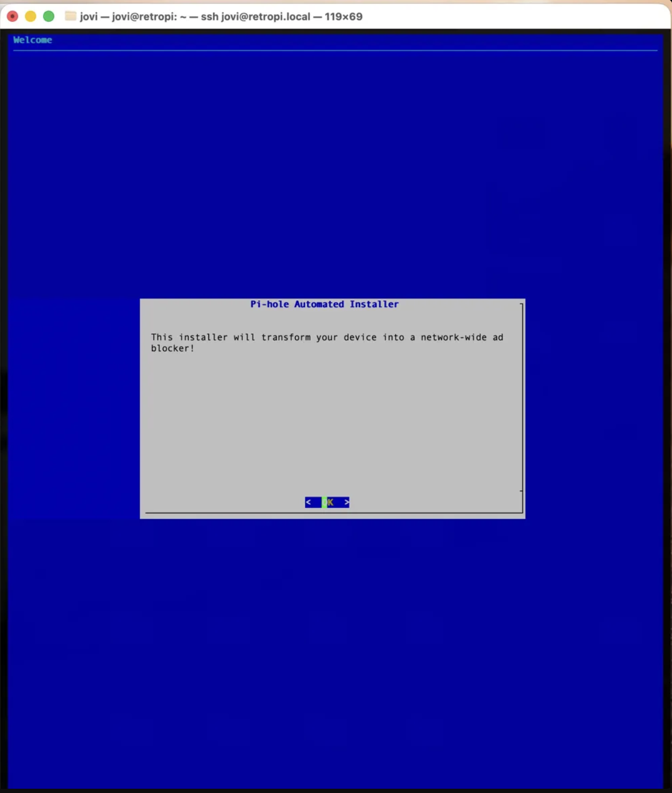
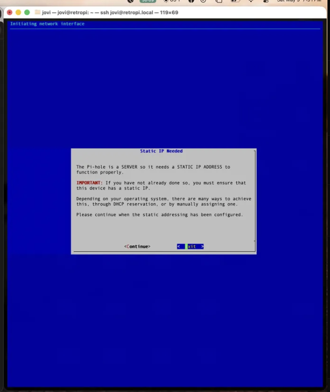
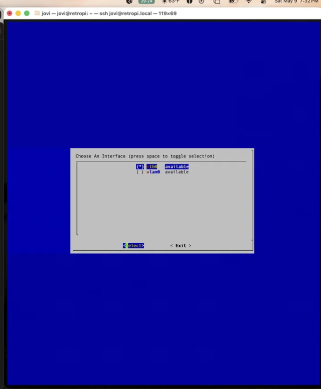
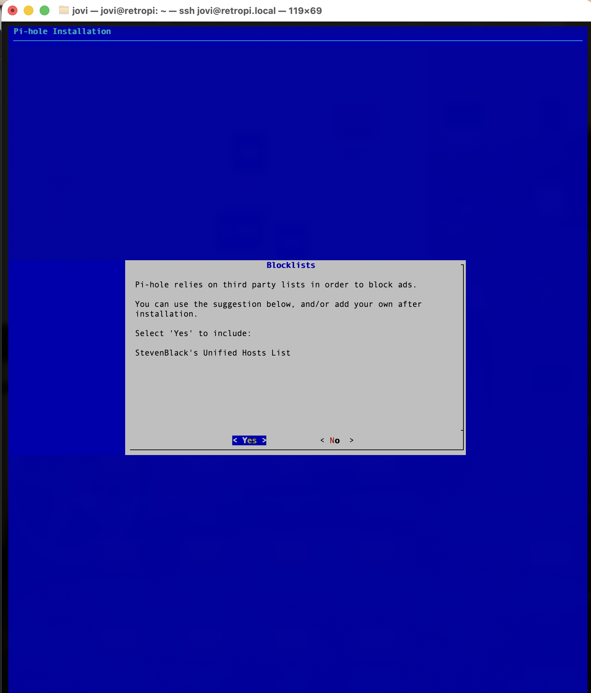
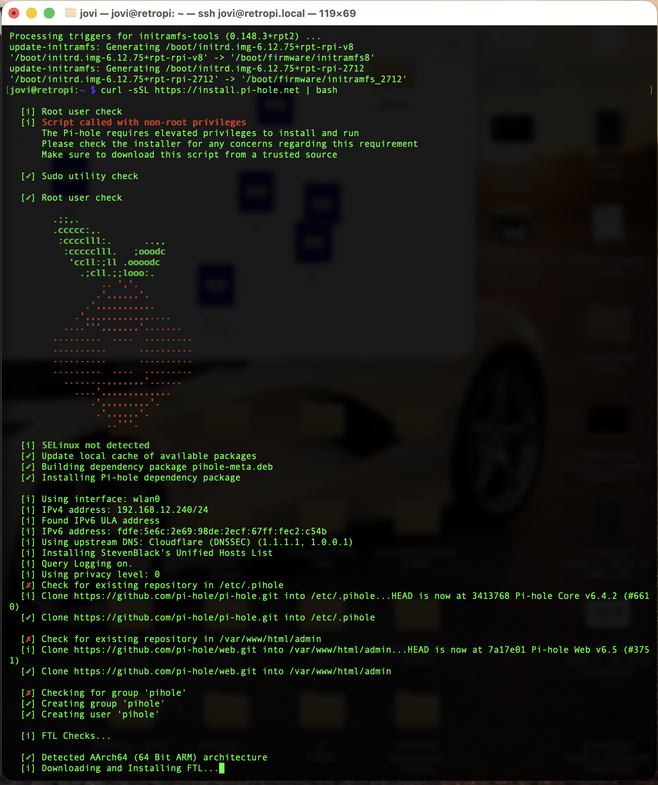
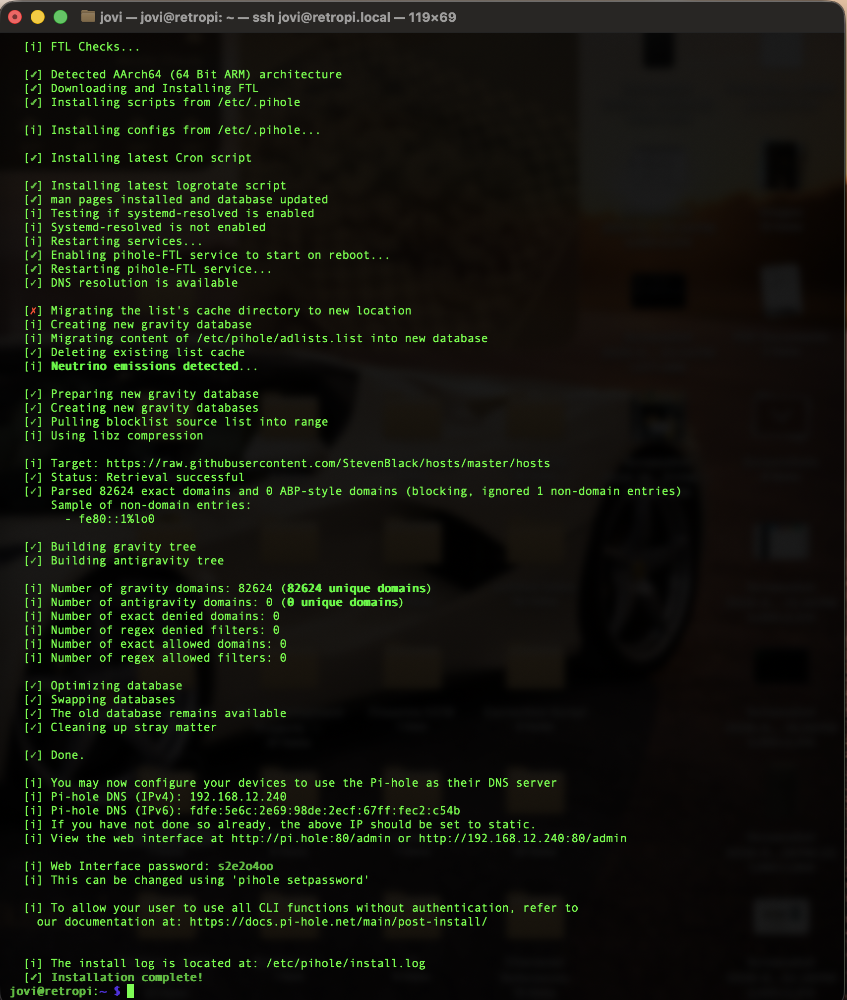

# Pi-hole — Network-Wide DNS Ad Blocker

## Problem
Every device on the home network was loading ads and trackers directly, with zero visibility into what domains were being queried across the network.

## Solution
Deployed Pi-hole as a network-wide DNS sinkhole on the Raspberry Pi, blocking ad/tracker domains at the DNS level for every device on the network — no per-device ad blocker needed.

### Setup steps
1. Ran the official installer: `curl -sSL https://install.pi-hole.net | bash`
2. Selected `wlan0` as the network interface (Pi was WiFi-connected at the time of this install)
3. Confirmed static IP requirement — Pi-hole needs a fixed IP since it's acting as the network's DNS server
4. Selected **Cloudflare (DNSSEC)** as the upstream DNS provider
5. Included StevenBlack's Unified Hosts List as the blocklist source
6. Installer parsed and loaded blocklist, enabled `pihole-FTL` service on boot

### Result
- **82,624 domains** loaded into the blocklist
- DNS resolution confirmed working (`DNS resolution is available`)
- Admin web interface live at `http://192.168.12.240/admin`
- Blocking 18%+ of all DNS queries network-wide

## Proof

## Resume line
"Deployed network-wide DNS sinkhole blocking ads and trackers across all connected devices, achieving 18%+ query block rate with an 82,000+ domain blocklist"