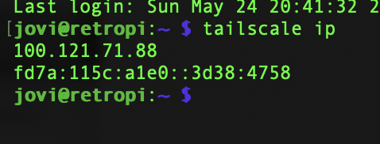
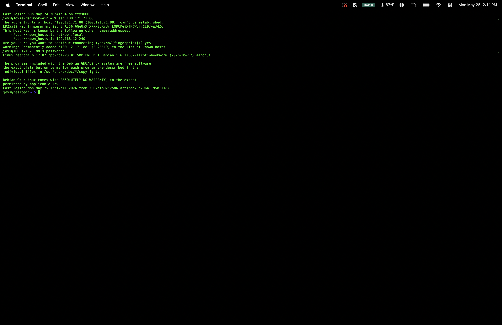
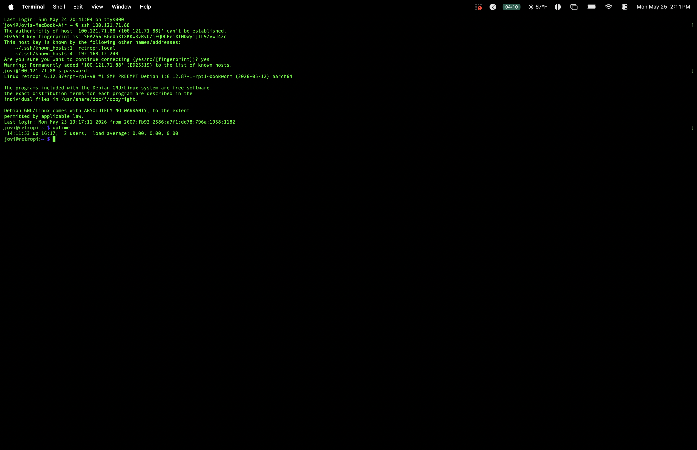
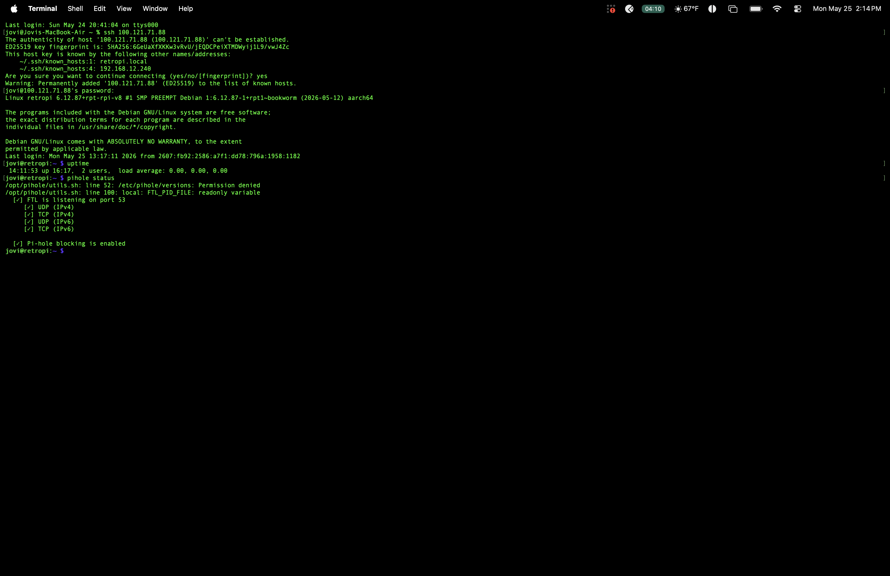

# Tailscale VPN

## What I Built
Configured Tailscale mesh VPN to enable secure remote access to the Pi from anywhere without port forwarding.

## Why Tailscale
- T-Mobile gateway doesn't support port forwarding
- Tailscale creates an encrypted mesh network between devices
- Pi gets a permanent Tailscale IP (100.121.71.88) accessible from anywhere
- No exposed ports on home network

## What This Enables
- SSH into Pi from anywhere in the world
- Access Pi-hole dashboard remotely
- Remote viewing of security camera via MotionEye
- All traffic encrypted end to end

## Live Demo — SSH From Suju's Coffee
SSHed into retropi from Suju's Coffee in Union City using Tailscale IP 100.121.71.88






## Key Commands
```bash
# Check Tailscale IP
tailscale ip

# SSH via Tailscale from anywhere
ssh jovi@100.121.71.88

# Verify Pi-hole running remotely
pihole status
```

## Skills Demonstrated
- VPN mesh networking
- Secure remote server administration
- Network access without port forwarding