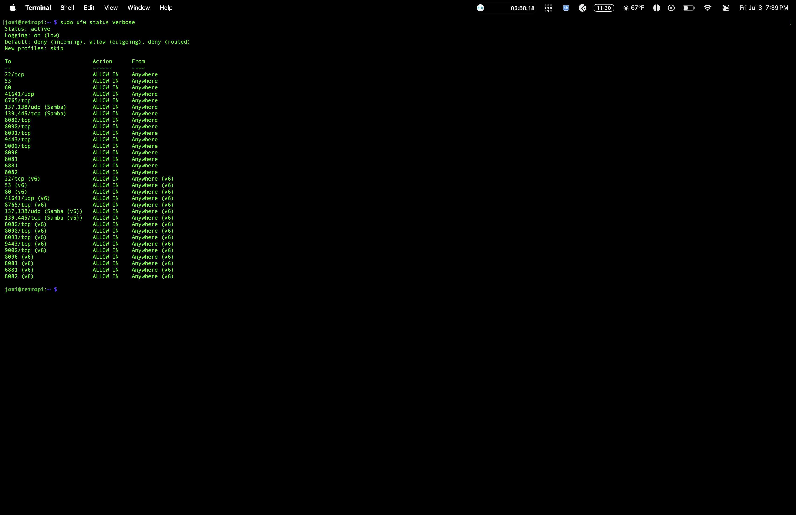
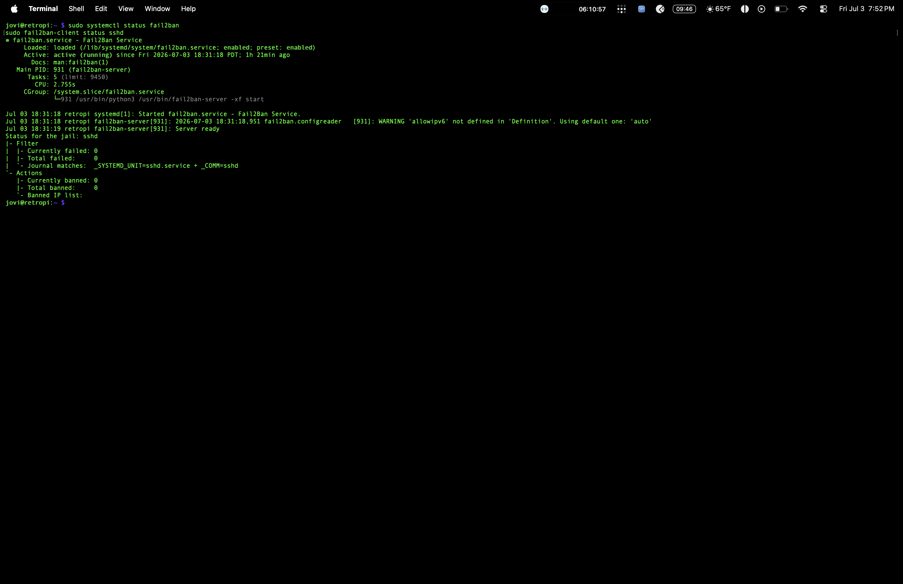
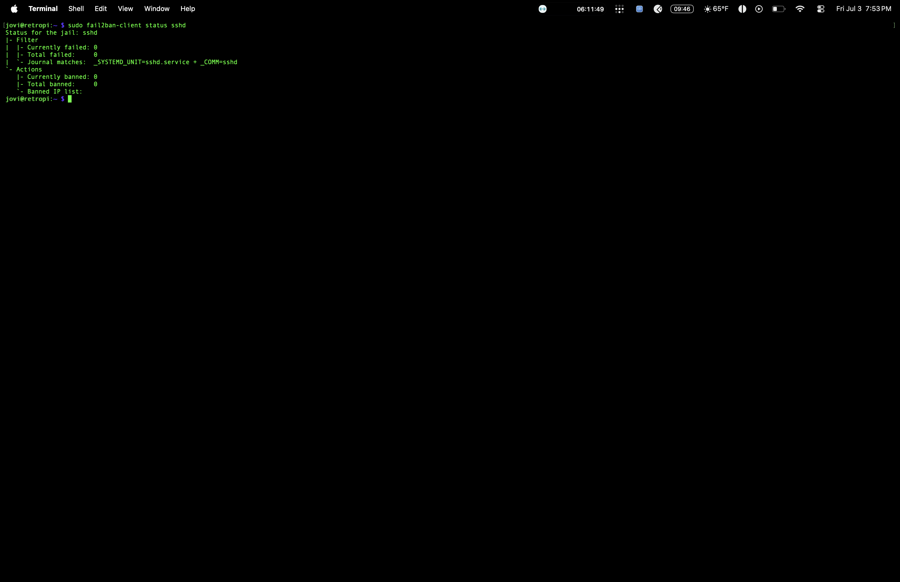
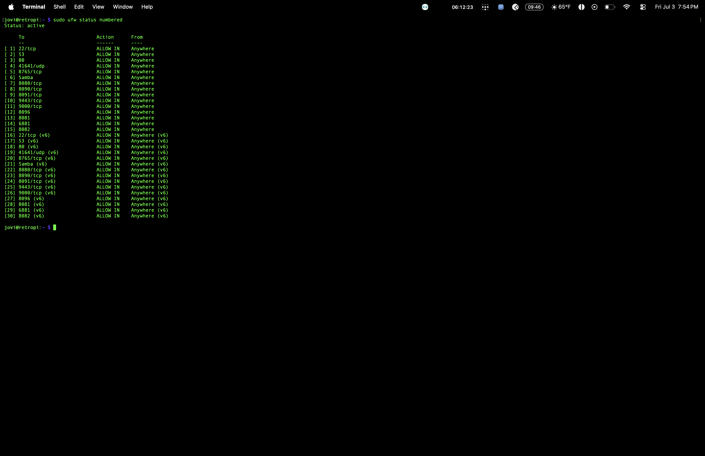

# UFW Firewall + Fail2ban — Linux Server Hardening

## Problem
A freshly deployed Pi has zero network protection out of the box — every port is open, and SSH is exposed to unlimited brute-force login attempts from anywhere on the internet or local network.

## Solution
Configured UFW (Uncomplicated Firewall) to allow only necessary ports, and layered Fail2ban on top to automatically detect and ban IPs after repeated failed SSH login attempts.

### Steps taken
1. Installed and enabled UFW
2. Set default policy: deny incoming, allow outgoing
3. Allowed only required ports (SSH, Samba, etc.)
4. Installed Fail2ban, configured the `sshd` jail
5. Tested by deliberately triggering failed logins and confirming a real ban

## Proof

## Resume line
"Hardened Linux server against brute-force attacks using UFW and Fail2ban"