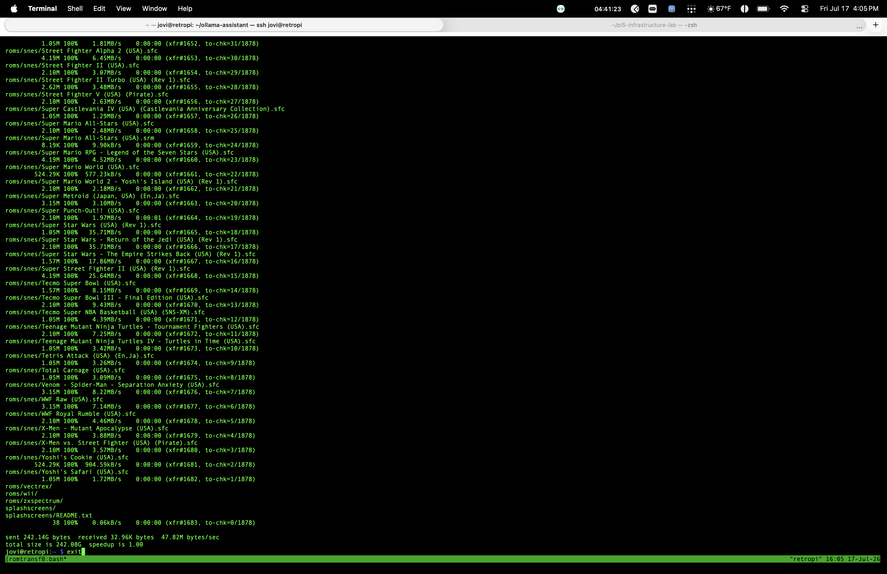
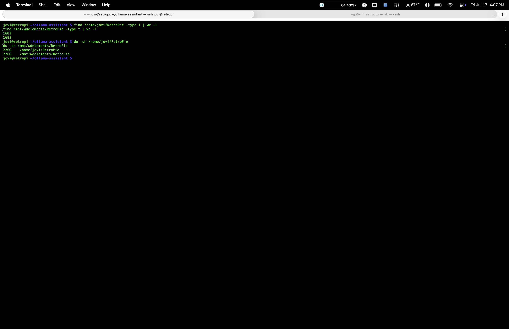
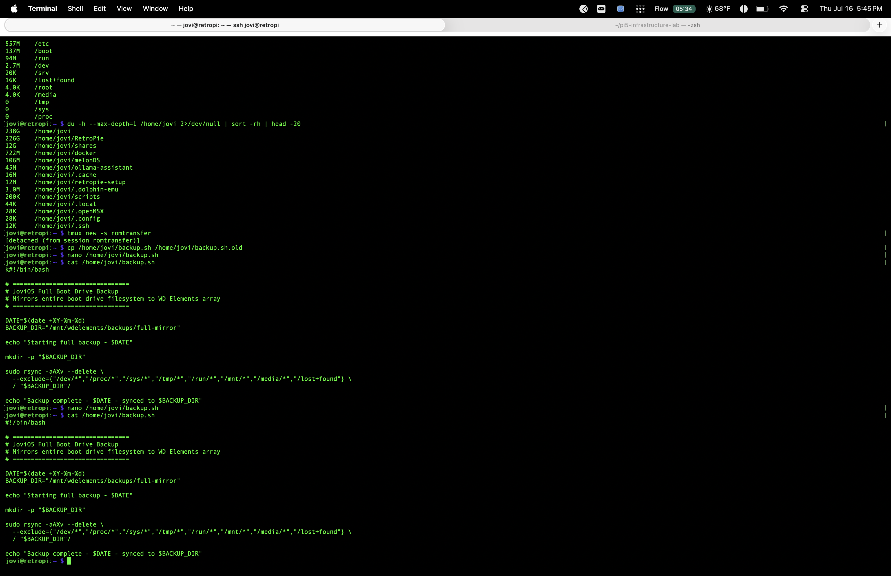
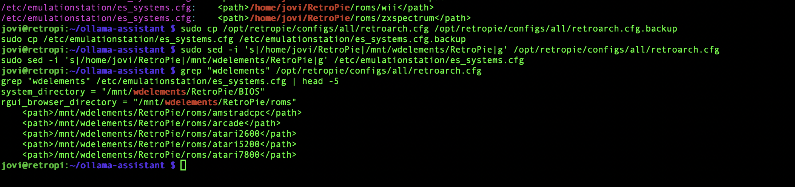

# 12.5 — Boot Drive Migration: T7 Repurposing + Storage Right-Sizing

## Problem
Samsung T7 1TB was serving as the Pi's boot drive but sitting at 917G total 
with only ~73G of actual system/Docker footprint after RetroPie's 226G ROM 
library was moved off — meaning 800G+ of a fast portable SSD was being wasted 
on a job that needed a fraction of that capacity. Meanwhile, VMs and 
emulators (Windows/Linux VMs, PS2/PS3 libraries) were running out of room 
on the MacBook with no dedicated external storage to offload to.

## Solution
Right-sized the boot drive down to a 256GB SSK SSD, freeing the T7 to become 
dedicated external VM/emulator storage for the MacBook. Broke the migration 
into four connected phases:

### Phase 1 — Storage Audit + RetroPie Relocation
- Ran `df -h` and `du -h --max-depth=1` to map actual T7 usage
- Identified RetroPie's ROM library (226G) as the single largest, safely 
  relocatable chunk — confirmed Docker configs/databases stayed genuinely 
  small (722M) and didn't need to move
- Migrated RetroPie to `/mnt/wdelements/RetroPie` via `rsync -avh --progress` 
  inside a `tmux` session (persistent across SSH disconnects)
- Verified copy integrity with `find | wc -l` (file count match: 1683/1683) 
  and `du -sh` (size match: 226G/226G) before touching the original
- Updated all path references in `retroarch.cfg` and `es_systems.cfg` via 
  `sed -i` — found and swapped every hardcoded ROM path across both files 
  in one pass instead of manual per-line editing

### Phase 2 — Backup Strategy Upgrade
- Audited the existing nightly backup script (Project #12) and found a real 
  coverage gap: it only backed up 6 hardcoded items from when it was 
  written, missing everything added since — including Vaultwarden's entire 
  password vault
- Rewrote the script from a selective file list to a full-filesystem 
  `rsync -aAXv --delete` mirror, with deliberate excludes for virtual 
  filesystems (`/proc`, `/dev`, `/sys`) and to prevent the WD array from 
  backing up into itself (`/mnt/*` excluded)
- Verified the exclude list with `--dry-run` before running for real

### Phase 3 — Boot Drive Sizing
- Calculated realistic 1-year storage growth (Ollama model upgrades, 
  Immich ML cache, Grafana/Prometheus metric retention, general Docker 
  image bloat) — projected ~120-125G within a year
- Chose 256GB as the target size for meaningful headroom without overbuying
- Ruled out NVMe upgrade — GeeekPi Dreamcast case has no room for the 
  official M.2 HAT+ without losing the ability to close the case
- Purchased SSK 256GB portable SSD (USB 3.2 Gen2, SATA-600, SMART/TRIM 
  supported) as a budget-appropriate match for a workload that's dominated 
  by small random I/O, not sustained large transfers

### Phase 4 — Remote OS Flash (In Progress)
- Confirmed flashing a fresh boot drive doesn't require physical access — 
  the Pi can write a new OS image directly to a second USB-attached drive 
  while running live off the current boot drive, entirely over Tailscale
- New drive identified via `lsblk` as `/dev/sdd` before any write commands 
  to avoid targeting the wrong device

## Known Issues Caught
- `nano` left a stray character (`k`) at the very start of the rewritten 
  backup script, corrupting the shebang line (`k#!/bin/bash`) — caught via 
  the standard "always `cat` the file back before running" rule, not by 
  the script actually failing. Reinforces why that rule exists.
- Discovered dead `openmediavault-flashmemory` and `openmediavault-omvextrasorg` 
  config leftovers still present on the T7 from the original OMV incident — 
  confirmed via `dpkg -l` that they were config-only remnants (`ic` status), 
  not actually running or affecting Tailscale/networking

## Resume Line
"Executed a live boot-drive migration on a headless server — including 
storage capacity planning, verified data migration, and a rewritten 
disaster-recovery backup strategy — entirely over remote SSH/VPN access"

## Screenshots

