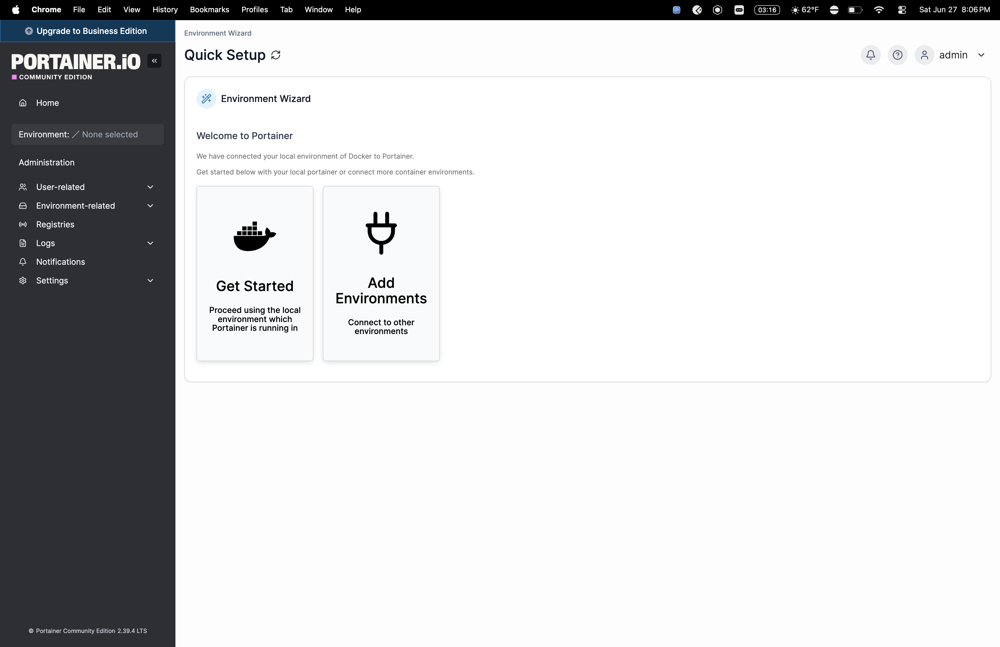
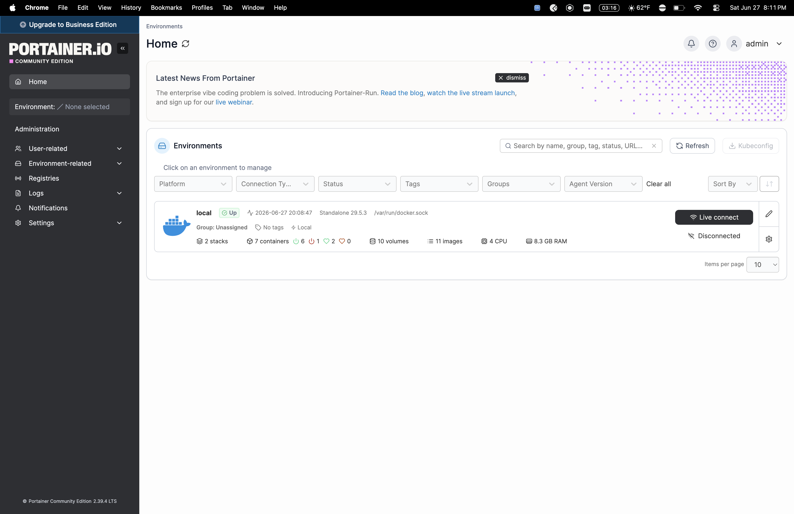
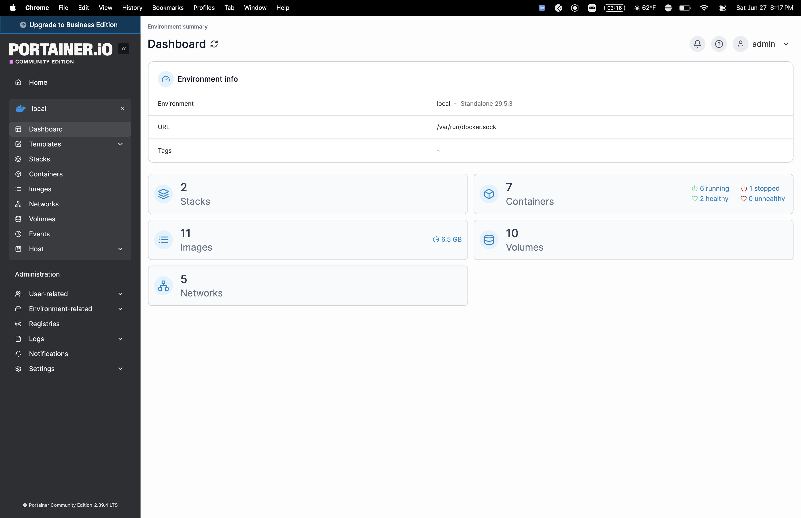
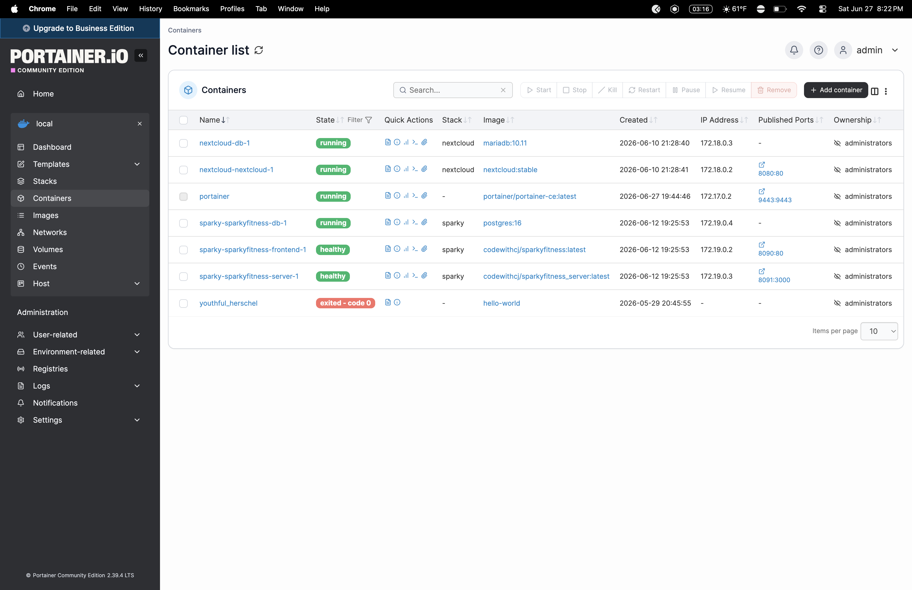
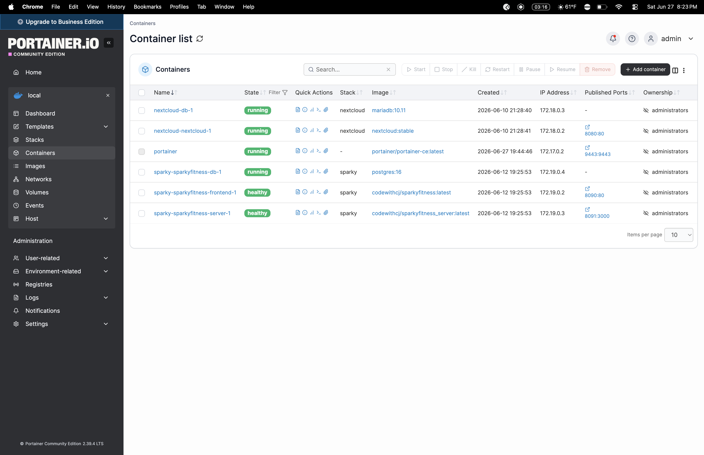

# 13 - Portainer Docker Lab

## Objective
Deploy Portainer CE as a Docker management GUI to visually manage all containers running on the Pi 5 homelab.

## Environment
- Hardware: Raspberry Pi 5 8GB
- OS: Raspberry Pi OS Lite 64-bit
- Docker version: 29.5.3
- Portainer version: CE 2.39.4 LTS

## What is Portainer?
Portainer is a lightweight web-based GUI for managing Docker environments. Instead of running docker ps, docker logs, or docker restart in the terminal every time, Portainer gives you a visual dashboard to manage all containers, images, volumes, and networks in one place.

## Steps Taken

### 1. Pulled and ran Portainer CE container
docker run -d \
  -p 9443:9443 \
  --name portainer \
  --restart=always \
  -v /var/run/docker.sock:/var/run/docker.sock \
  -v portainer_data:/data \
  portainer/portainer-ce:latest

### 2. Opened UFW port
sudo ufw allow 9443/tcp

### 3. Accessed via browser
https://retropi.local:9443

### 4. Created admin account using setup token from docker logs

## Result
Portainer CE deployed and accessible via browser. All 6 running containers visible and manageable through the GUI.

## Containers Under Management
- nextcloud-nextcloud-1 (running)
- nextcloud-db-1 (running)
- sparky-sparkyfitness-frontend-1 (healthy)
- sparky-sparkyfitness-server-1 (healthy)
- sparky-sparkyfitness-db-1 (running)
- portainer (running)

## Resume Bullet
"Deployed Portainer CE Docker management GUI to centrally monitor and manage all self-hosted containers on Raspberry Pi 5 homelab"
