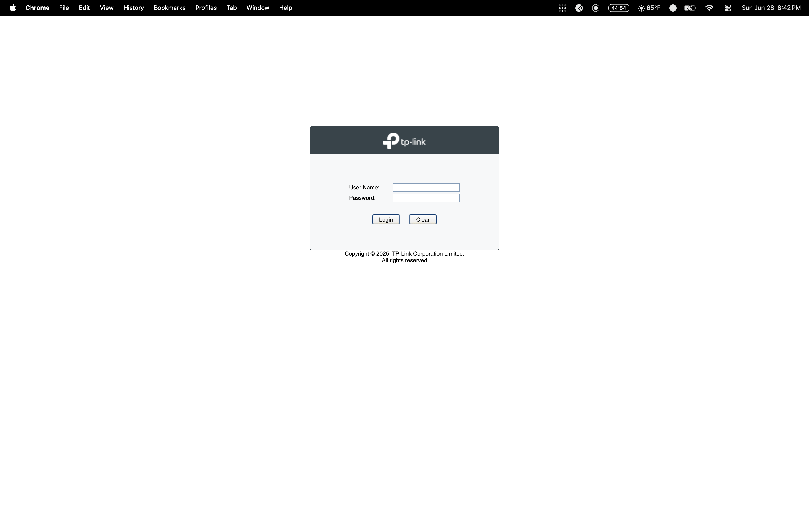
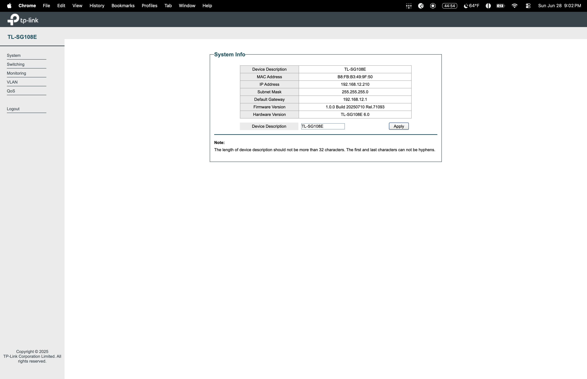
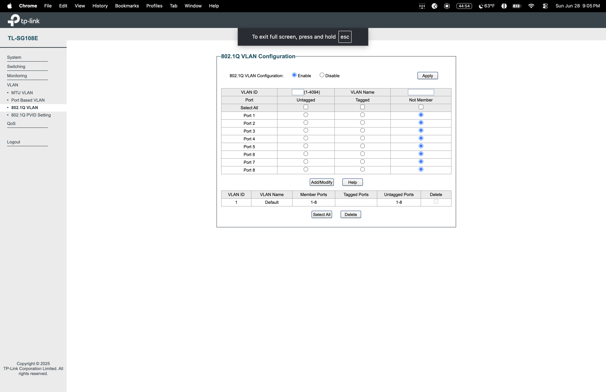
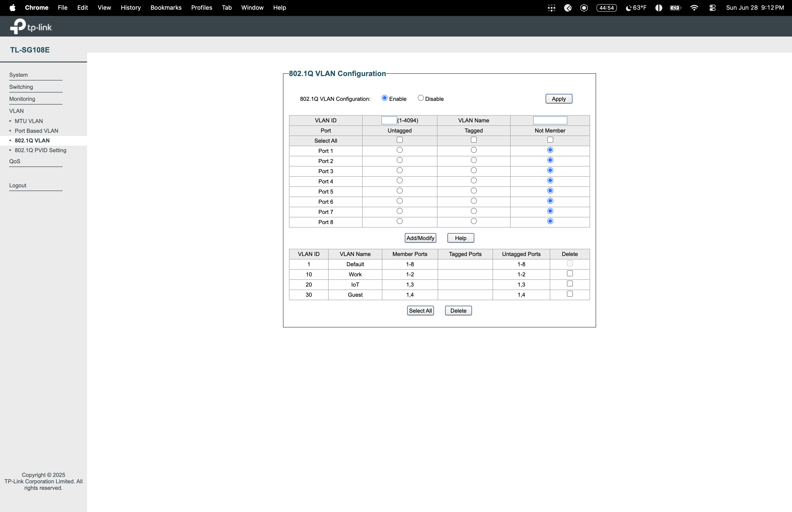
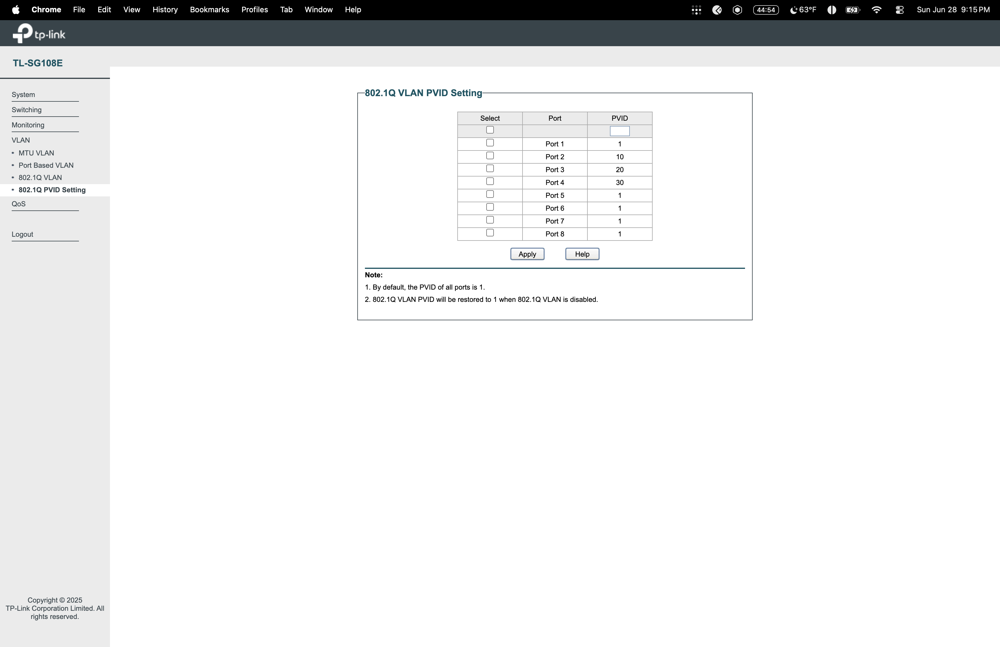

# 14 — VLAN Segmentation Lab — TP-Link TL-SG108E
**Hardware:** TP-Link TL-SG108E 8-Port Gigabit Easy Smart Switch  
**Switch IP:** 192.168.12.210  
**Network:** 192.168.12.0/24  
**Access Method:** SSH SOCKS proxy via Pi (Tailscale) → browser  

---

## Objective
Configure 802.1Q VLAN segmentation on a managed switch to isolate network traffic into separate segments — Work, IoT, and Guest — preventing devices on different VLANs from communicating with each other while maintaining internet access for all.

---

## Hardware Setup
T-Mobile Gateway (192.168.12.1)

↓ ethernet — Port 1 (uplink)

TP-Link TL-SG108E Switch (192.168.12.210)

├── Port 2 → Raspberry Pi 5 (VLAN 10 Work)

├── Port 3 → IoT devices (VLAN 20 IoT)

├── Port 4 → Guest devices (VLAN 30 Guest)

└── Ports 5-8 → spare

---

## VLAN Architecture

| VLAN ID | Name | Ports | Purpose |
|---------|------|-------|---------|
| 1 | Default | 1-8 | Switch management |
| 10 | Work | 1, 2 | Pi 5 and work devices |
| 20 | IoT | 1, 3 | Cameras, smart devices |
| 30 | Guest | 1, 4 | Guest network access |

**Port 1 is the uplink** — it must be a member of all VLANs so traffic can reach the router from any segment.

---

## What I Did

### Step 1 — Physical Setup
Connected T-Mobile gateway to Switch Port 1 and Raspberry Pi 5 to Switch Port 2. Switch received IP 192.168.12.210 via DHCP from router — confirmed via nmap scan from the Pi.

### Step 2 — Accessing Switch Web Interface
Mac has no ethernet port so used SSH SOCKS proxy through the Pi to reach the switch web UI:

```bash
ssh -D 9090 -N jovi@100.121.71.88
```

Configured Mac System Settings → Network → Proxies → SOCKS proxy: 127.0.0.1:9090. Then accessed switch directly at http://192.168.12.210.

### Step 3 — Login and Initial Setup
Default credentials admin/admin. Switch forced password change on first login for security.





### Step 4 — Enabled 802.1Q VLAN
Navigated to VLAN → 802.1Q VLAN → selected Enable → clicked Apply.



### Step 5 — Created VLANs

**VLAN 10 — Work:**
- Port 1: Untagged (uplink to router)
- Port 2: Untagged (Raspberry Pi 5)
- Ports 3-8: Not Member

**VLAN 20 — IoT:**
- Port 1: Untagged (uplink to router)
- Port 3: Untagged (IoT device port)
- Ports 2, 4-8: Not Member

**VLAN 30 — Guest:**
- Port 1: Untagged (uplink to router)
- Port 4: Untagged (guest device port)
- Ports 2-3, 5-8: Not Member



### Step 6 — Configured PVID Settings
Set Port VLAN IDs so each port automatically assigns traffic to the correct VLAN:

- Port 1: PVID 1 (uplink)
- Port 2: PVID 10 (Work)
- Port 3: PVID 20 (IoT)
- Port 4: PVID 30 (Guest)
- Ports 5-8: PVID 1



---

## Key Concepts

**802.1Q VLAN** — the industry standard for VLAN tagging. Adds a 4-byte tag to ethernet frames identifying which VLAN the traffic belongs to.

**Untagged port** — the device connected doesn't know it's on a VLAN. It just sees a normal network. Used for end devices like PCs, Pi, cameras.

**Tagged port** — passes VLAN labels through. Used for uplinks carrying multiple VLANs simultaneously.

**PVID (Port VLAN ID)** — the default VLAN a port assigns to untagged incoming traffic. Must match the VLAN the port is a member of.

**Why Port 1 is on every VLAN** — Port 1 is the uplink to the router. Without it on every VLAN, devices on VLAN 20 and 30 would have no path to the internet.

---

## Network Isolation Result

| From → To | VLAN 10 Work | VLAN 20 IoT | VLAN 30 Guest | Internet |
|-----------|-------------|-------------|---------------|----------|
| VLAN 10 Work | ✅ | ❌ | ❌ | ✅ |
| VLAN 20 IoT | ❌ | ✅ | ❌ | ✅ |
| VLAN 30 Guest | ❌ | ❌ | ✅ | ✅ |

Each VLAN can reach the internet but cannot reach devices on other VLANs.

---

## Real World Application
VLANs are how every enterprise network is architected. Separating IoT devices from corporate workstations is a security best practice — a compromised smart device cannot pivot to sensitive systems. Guest WiFi on its own VLAN is standard in every office, hotel, and coffee shop.

**Resume line:** "Configured 802.1Q VLAN segmentation on managed switch for network isolation — Work, IoT, and Guest segments"

---

## What I Learned
- Managed switches require 802.1Q VLAN configuration for true network isolation
- Port 1 (uplink) must be a member of every VLAN or downstream devices lose internet
- PVID determines which VLAN untagged traffic is assigned to on ingress
- SSH SOCKS proxy is a powerful workaround when direct network access isn't available
- Mac with no ethernet can still manage wired network devices via proxy through a Pi

---

## Files
14-VLAN-Managed-Switch-Lab/

├── README.md

├── failures.md

└── screenshots/

├── 14-vlan-switch-login.png

├── 14-vlan-switch-dashboard.png

├── 14-vlan-menu.png

├── 14-vlan-8021q-config.png

├── 14-vlan-8021q-enabled.png

├── 14-vlan-10-work-created.png

├── 14-vlan-20-iot-created.png

├── 14-vlan-all-three-created.png

├── 14-vlan-pvid-before.png

└── 14-vlan-pvid-configured.png
