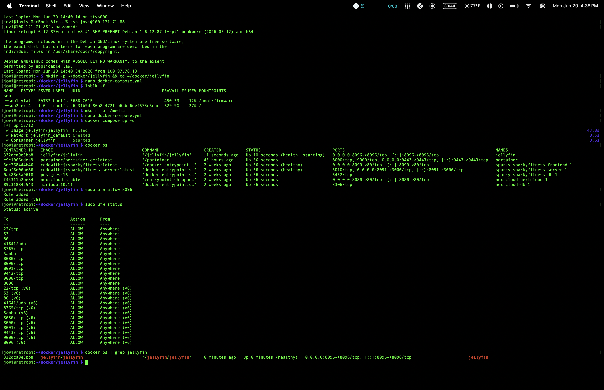
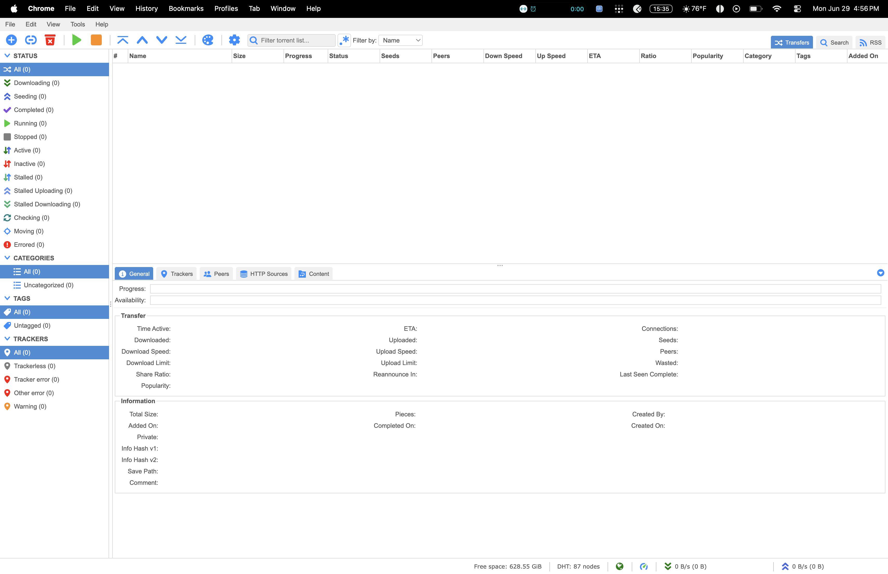
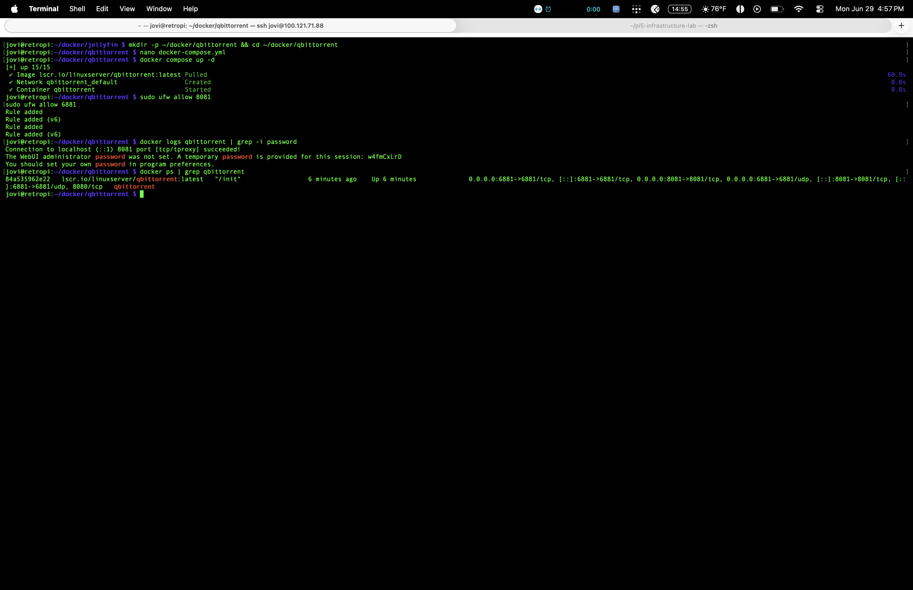

# Jellyfin Media Server

Self-hosted media streaming server running in Docker on the Pi 5. Personal Netflix — no subscriptions, no third party access to my media library.

## What It Does

Jellyfin serves movies, TV shows, and music directly from the Pi to any device on the network or remotely via Tailscale. Fully self-hosted, fully private.

## Stack

- **Jellyfin** (Docker container)
- **Docker Compose** for deployment
- **Tailscale** for remote access
- **UFW** for firewall management

## Setup

1. Created project directory and docker-compose.yml
2. Deployed Jellyfin container via `docker compose up -d`
3. Opened port 8096 in UFW for access
4. Completed setup wizard — created admin account, configured remote access
5. Pointed media storage temporarily at local Pi storage (Samsung T7 SSD), pending migration to dedicated WD Elements 6TB drive once powered USB hub arrives

## Proof

### Dashboard Running

### Container Status

### UFW Firewall Rule

## Access

- Local: `http://192.168.12.239:8096`
- Remote (Tailscale): `http://100.121.71.88:8096`

## Lessons Learned

- Docker-based apps are safe with Tailscale — no networking conflicts like OMV caused
- External drives need a *powered* USB hub on a Pi — bus power alone isn't reliable for spinning/large drives
- Planned the migration path before buying hardware: confirmed switching storage later is just a one-line docker-compose volume path change, no data loss risk

## Next Steps

- [ ] Migrate media storage to WD Elements 6TB once powered hub (SABRENT HB-BU10) arrives
- [ ] Format WD Elements to ext4
- [ ] Add first media library once content is loaded

## qBittorrent Integration

qBittorrent runs alongside Jellyfin as the download client. Downloads go straight to the same media folder Jellyfin watches — no manual file transfers needed.

- **WebUI:** `http://100.121.71.88:8081`
- **Download path:** `/downloads` (maps to `/home/jovi/media` on Pi)
- **Port:** 8081 (WebUI), 6881 (torrents)

### qBittorrent Dashboard

### qBittorrent Container Running

