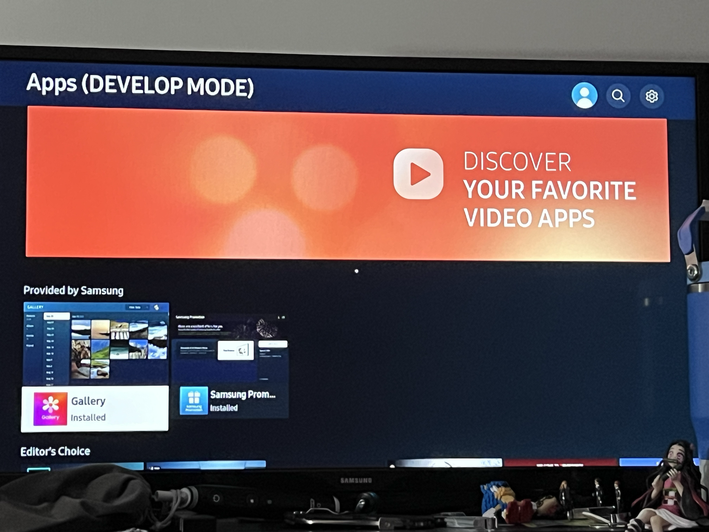
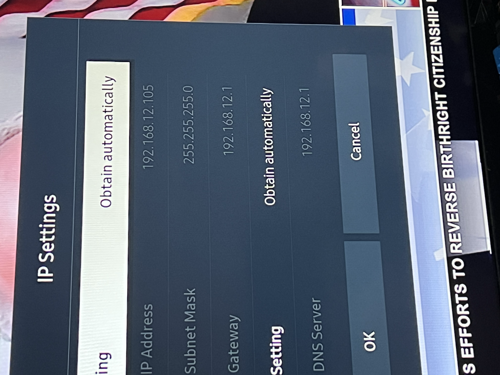
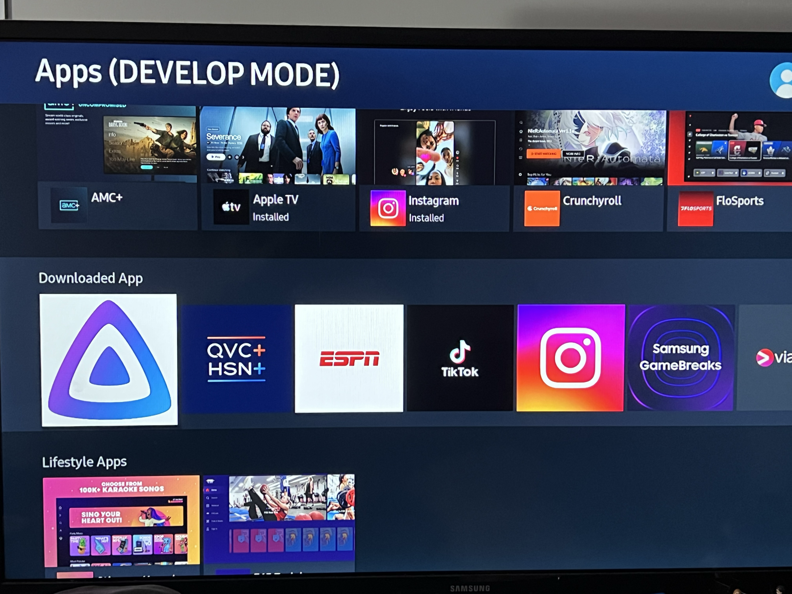
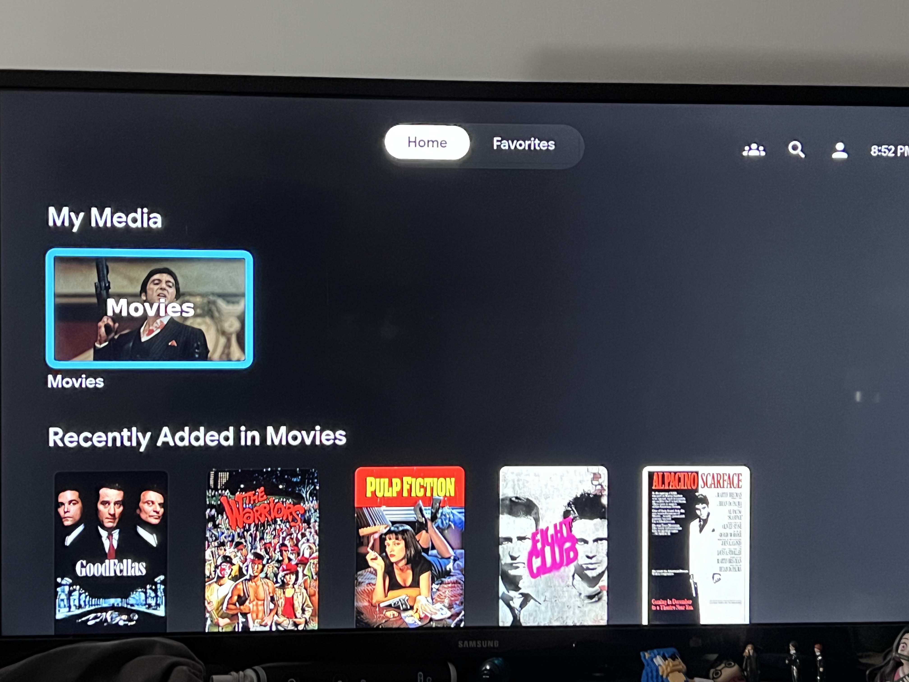

# Jellyfin Media Server

Self-hosted media streaming server running in Docker on the Pi 5. Personal Netflix — no subscriptions, no third party access to my media library.

## What It Does

Jellyfin serves movies, TV shows, and music directly from the Pi to any device on the network or remotely via Tailscale. Fully self-hosted, fully private.

## Stack

- **Jellyfin** (Docker container)
- **Docker Compose** for deployment
- **Tailscale** for remote access
- **UFW** for firewall management

## Setup

1. Created project directory and docker-compose.yml
2. Deployed Jellyfin container via `docker compose up -d`
3. Opened port 8096 in UFW for access
4. Completed setup wizard — created admin account, configured remote access
5. Pointed media storage temporarily at local Pi storage (Samsung T7 SSD), pending migration to dedicated WD Elements 6TB drive once powered USB hub arrives

## Proof

### Dashboard Running

### Container Status

### UFW Firewall Rule

## Access

- Local: `http://192.168.12.239:8096`
- Remote (Tailscale): `http://100.121.71.88:8096`

## Lessons Learned

- Docker-based apps are safe with Tailscale — no networking conflicts like OMV caused
- External drives need a *powered* USB hub on a Pi — bus power alone isn't reliable for spinning/large drives
- Planned the migration path before buying hardware: confirmed switching storage later is just a one-line docker-compose volume path change, no data loss risk

## Next Steps

- [ ] Migrate media storage to WD Elements 6TB once powered hub (SABRENT HB-BU10) arrives
- [ ] Format WD Elements to ext4
- [ ] Add first media library once content is loaded

## qBittorrent Integration

qBittorrent runs alongside Jellyfin as the download client. Downloads go straight to the same media folder Jellyfin watches — no manual file transfers needed.

- **WebUI:** `http://100.121.71.88:8081`
- **Download path:** `/downloads` (maps to `/home/jovi/media` on Pi)
- **Port:** 8081 (WebUI), 6881 (torrents)

### qBittorrent Dashboard

### qBittorrent Container Running

## Full Pipeline Test — Scarface (1983)

Downloaded via qBittorrent directly to the Pi, automatically detected by Jellyfin, metadata and poster pulled from TheMovieDB. Full end-to-end test successful.

### Movie Page

### Streaming

## Cloudflare Tunnel + Custom Domain (jovis.casa)

Set up Cloudflare Tunnel to expose Jellyfin and other self-hosted services to the internet via a custom domain, without port forwarding or exposing the home network directly.

### Setup

1. Purchased domain `jovis.casa` via Cloudflare registrar
2. Created Cloudflare Zero Trust account (Free tier)
3. Installed `cloudflared` on the Pi and registered it as a systemd service
4. Created tunnel `jovi-pi-tunnel`, connected and healthy
5. Added published application routes mapping subdomains to local services:
   - `jovis.casa` → `http://localhost:8096` (Jellyfin, root domain)
   - `vaultwarden.jovis.casa` → `http://localhost:8082`
   - `nextcloud.jovis.casa` → `http://localhost:8080`
   - `qbittorrent.jovis.casa` → `http://localhost:8081`
   - `portainer.jovis.casa` → `https://localhost:9443`
   - `sparkyfitness.jovis.casa` → `http://localhost:8090`

### Result

Services are now accessible via clean HTTPS URLs from anywhere — no Tailscale client required for friends/family, no IP:port combos.

## Failure: Tailscale MagicDNS Resolution Bug

After setup, `jovis.casa` failed to resolve specifically on my Mac, while working fine on mobile data and other browsers.

**Debugging path:**
- Confirmed DNS records correct in Cloudflare dashboard
- Confirmed tunnel logs showed zero incoming requests for the domain — request wasn't reaching the tunnel at all
- Tested on phone (cellular) — worked
- Tested in Safari — worked
- Isolated to Chrome on Mac specifically
- Cleared Chrome DNS cache, HSTS policies, site permissions — no fix
- Ran `dig @100.100.100.100 jovis.casa` (Tailscale's MagicDNS resolver) — returned zero answers despite confirming the authoritative Cloudflare nameservers
- Ran `dig @1.1.1.1 jovis.casa` — resolved correctly
- Root cause: Tailscale's MagicDNS resolver had a stuck/broken forwarding state for this specific domain

**Fix:** Disabled and re-enabled MagicDNS in the Tailscale admin console. This force-refreshed the DNS forwarding state and resolved the issue immediately.

**Lesson learned:** When self-hosting with a VPN mesh network (Tailscale) active, the VPN's own DNS resolver sits in front of all DNS queries on the device — including ones that have nothing to do with the VPN network itself. A working Cloudflare Tunnel, correct DNS records, and a healthy connector mean nothing if the client device's resolver silently drops the query upstream. Systematic elimination (phone → other browser → DNS layer directly) was necessary to isolate the actual point of failure.

## Samsung TV — Jellyfin Sideload

Jellyfin was not available in the Samsung app store for this TV model/region. Sideloaded the official Jellyfin Tizen app using developer mode and Apps2Samsung.

### Setup

1. Enabled Developer Mode on TV — Apps screen → press 1-2-3-4-5 on remote → toggle ON → entered Mac's local IP (192.168.12.231) as Host PC IP
2. Found TV's IP address in Settings → General → Network → IP Settings (192.168.12.105)
3. Downloaded Apps2Samsung desktop app, selected Jellyfin - 2026-06-29 22:37, Jellyfin.wgt (10.12 MB)
4. TV auto-detected, clicked Download & Install — installation successful
5. Opened Jellyfin on TV, entered `https://jovis.casa` as server address, logged in

### Proof

### Developer Mode Enabled

### TV IP Address

### Developer Mode Host PC IP

### Installing via Apps2Samsung

### Installation Successful

### Jellyfin App on TV

### Jellyfin Running on Samsung TV

## Lesson Learned — Developer Mode IP Mismatch

Apps2Samsung requires the HOST machine's IP (the Mac doing the install) entered into the TV's Developer Mode settings, not the TV's own IP. Entering the wrong IP caused a "Developer Mode IP doesn't match this PC" error that blocked installation until corrected.