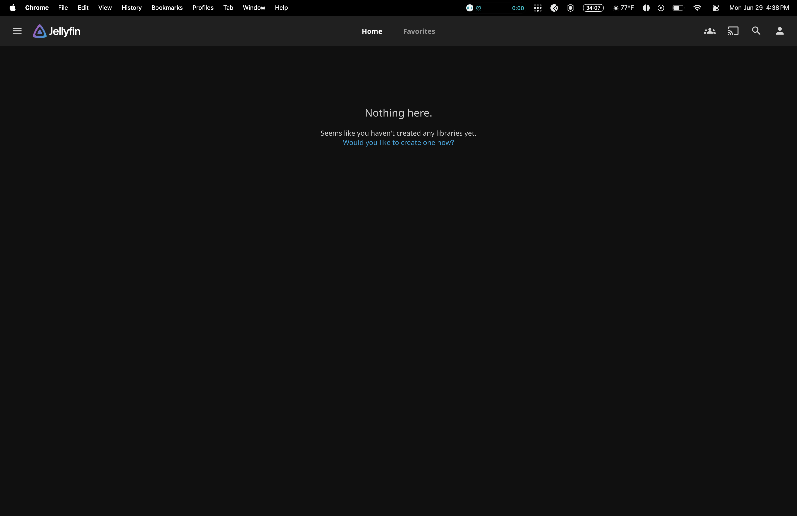
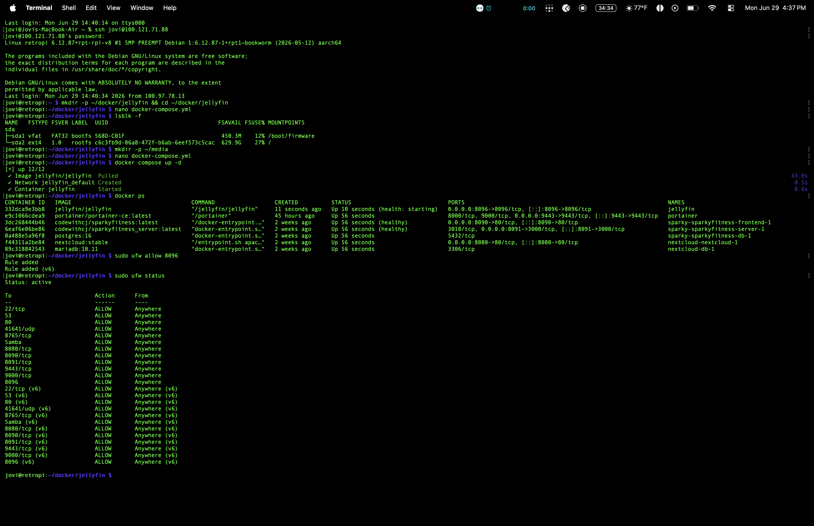
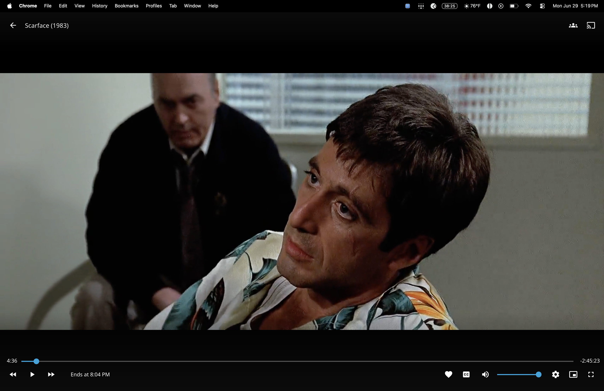
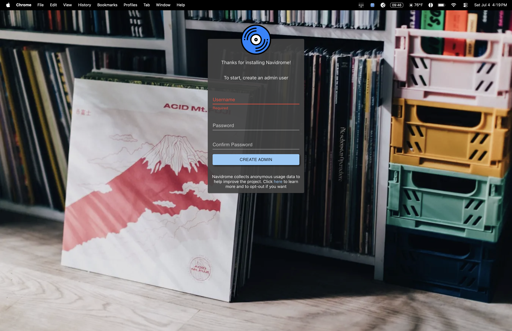
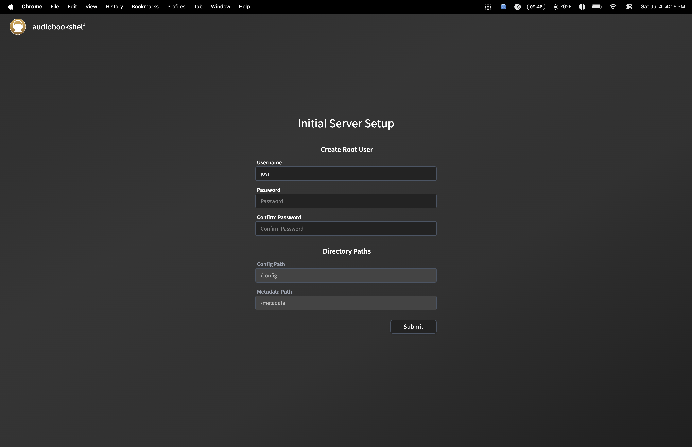
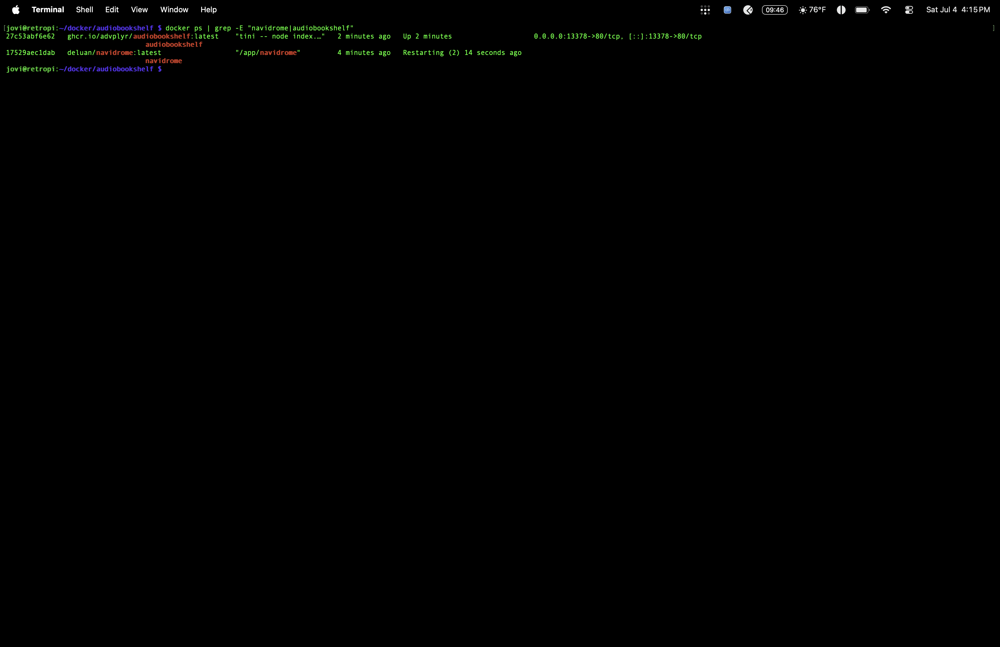
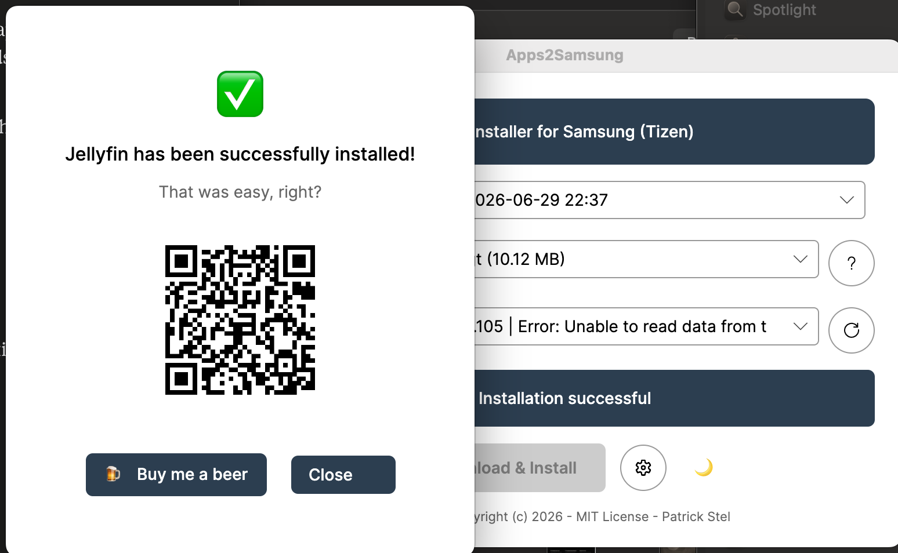

# Self-Hosted Media Stack — Jellyfin · Navidrome · Audiobookshelf · qBittorrent

Self-hosted media streaming server running in Docker on the Pi 5. Personal 
Netflix, Spotify, and Audible — no subscriptions, no third party access to 
my library.

## What It Does

Serves movies, TV shows, music, and audiobooks directly from the Pi to any 
device on the network, remotely via Tailscale, or publicly via Cloudflare 
Tunnel at jovis.casa. Fully self-hosted, fully private, fully automated 
from download to stream.

## Stack

- **Jellyfin** — movies & TV (Docker container)
- **Navidrome** — music streaming (Docker container)
- **Audiobookshelf** — audiobook library (Docker container)
- **qBittorrent** — download client, categorized routing (Docker container)
- **Portainer** — Docker management GUI
- **Docker Compose** for all deployments
- **Tailscale** for remote access
- **Cloudflare Zero Trust Tunnel** for public custom domain access
- **UFW** for firewall management

## Jellyfin — Setup

1. Created project directory and docker-compose.yml
2. Deployed via `docker compose up -d`
3. Opened port 8096 in UFW
4. Completed setup wizard — admin account, remote access configured
5. Media storage migrated from Samsung T7 (temporary) to dedicated WD 
   Elements 6TB drive once SABRENT powered hub arrived
6. Media organized into `/mnt/wdelements/movies` and `/mnt/wdelements/shows` 
   subfolders

## qBittorrent — Setup

1. Deployed alongside Jellyfin as the download client
2. Volume corrected from initial `/home/jovi/media` to `/mnt/wdelements` 
   (real media location)
3. Categories configured (movies/shows) with matching save paths
4. Full pipeline tested end-to-end: downloaded Scarface, auto-detected by 
   Jellyfin, metadata + poster pulled from TheMovieDB

## Navidrome — Setup

1. Deployed at port 4533, library mapped to `/mnt/wdelements/music` (read-only)
2. Hourly auto-scan configured (`ND_SCANSCHEDULE=1h`)
3. First-login admin account created via web UI

## Audiobookshelf — Setup

1. Deployed at port 13378, library mapped to `/mnt/wdelements/audiobooks`
2. Manual library scan on first import (same pattern as Jellyfin)
3. First-login admin account created via web UI

## Cloudflare Tunnel + Custom Domain (jovis.casa)

1. Purchased domain `jovis.casa` via Cloudflare registrar
2. Created Cloudflare Zero Trust account (Free tier)
3. Installed `cloudflared` on the Pi, registered as a systemd service
4. Created tunnel `jovi-pi-tunnel`, connected and healthy
5. Published application routes:
   - `jovis.casa` → `http://localhost:8096` (Jellyfin, root domain)
   - `vaultwarden.jovis.casa` → `http://localhost:8082`
   - `nextcloud.jovis.casa` → `http://localhost:8080`
   - `qbittorrent.jovis.casa` → `http://localhost:8081`
   - `portainer.jovis.casa` → `https://localhost:9443`
   - `sparkyfitness.jovis.casa` → `http://localhost:8090`

Services accessible via clean HTTPS URLs from anywhere — no Tailscale 
client required for friends/family, no IP:port combos.

## Samsung TV — Jellyfin Sideload

Jellyfin wasn't available in the Samsung app store for this TV model/region. 
Sideloaded the official Jellyfin Tizen app using developer mode and Apps2Samsung.

1. Enabled Developer Mode on TV — Apps screen → press 1-2-3-4-5 on remote → 
   toggle ON → entered Mac's local IP as Host PC IP
2. Found TV's IP in Settings → General → Network → IP Settings
3. Downloaded Apps2Samsung desktop app, selected Jellyfin.wgt
4. TV auto-detected, clicked Download & Install — successful
5. Opened Jellyfin on TV, entered `https://jovis.casa`, logged in

## CSS Theming — Root Cause Found

The Abyss theme issue wasn't a jsDelivr/network problem — the Pi could 
reach the CDN fine. The actual cause: Jellyfin's Kestrel webserver uses a 
build manifest that only serves files listed in it. Any unlisted static 
file (including a properly-placed abyss.css) gets silently blocked, 
regardless of correct file path or permissions.

**Fix:** Injected the Abyss CSS content directly into an existing 
manifest-listed file (`main.jellyfin.[hash].css`) instead of adding a new file.

Also discovered separately: the Dashboard → Branding → Custom CSS textbox 
wasn't injecting into the page at all — confirmed via `view-source:` 
showing zero trace of the custom CSS in the actual HTML. Two separate bugs.

A custom favicon was also created via ImageMagick and swapped in at the 
exact hashed filename Jellyfin's manifest expects.

## Media Organization Fixes

- Daredevil Born Again Season 1 + 2 restructured into one show folder with 
  `Season 01`/`Season 02` subfolders — Jellyfin was treating them as two 
  separate shows until fixed
- Deleted old pre-migration `/home/jovi/media` folder (19GB of confirmed 
  duplicates already present on the WD array)

## Access

- Local: `http://192.168.12.239:8096` (Jellyfin), `:4533` (Navidrome), 
  `:13378` (Audiobookshelf), `:8081` (qBittorrent)
- Remote (Tailscale): same ports via `100.121.71.88`
- Public: `https://jovis.casa` (Jellyfin root) + subdomains for other services

## Proof

### Jellyfin

### qBittorrent

### Navidrome

### Audiobookshelf

### Navidrome + Audiobookshelf Containers

### Samsung TV Sideload

## Lessons Learned

- Docker-based apps are safe with Tailscale — no networking conflicts 
  like OMV caused
- External drives need a *powered* USB hub — bus power alone isn't 
  reliable for spinning/large drives
- When self-hosting behind a VPN mesh network, the VPN's own resolver 
  sits in front of ALL DNS queries — even unrelated domains
- Empty string ≠ unset variable in Docker environment configs
- CSS/static file issues aren't always caching or CDN problems — check 
  the actual served page source before assuming

## Resume Line

"Deployed a full self-hosted media stack — Jellyfin, Navidrome, 
Audiobookshelf, and qBittorrent — using Docker containerization, exposed 
securely via Cloudflare Zero Trust Tunnel with a custom domain, with 
categorized automated download routing and cross-container management 
via Portainer"