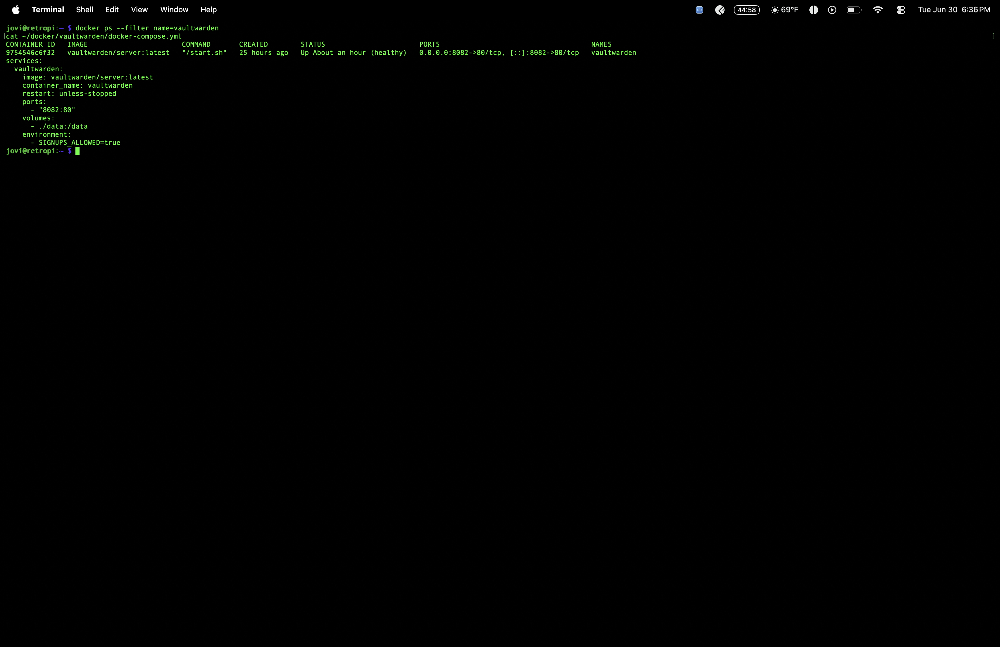
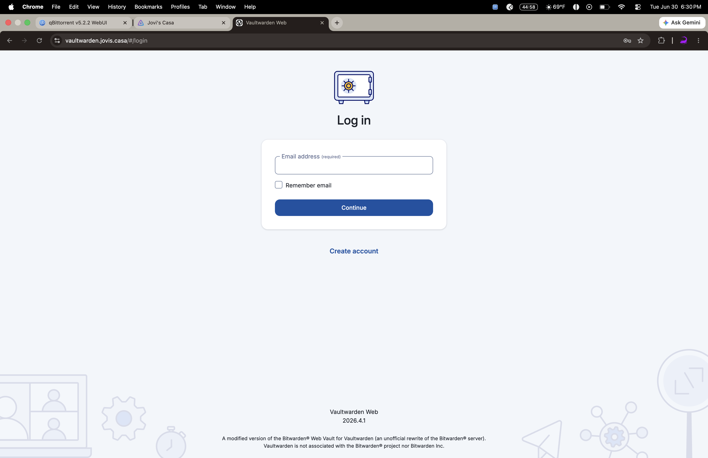
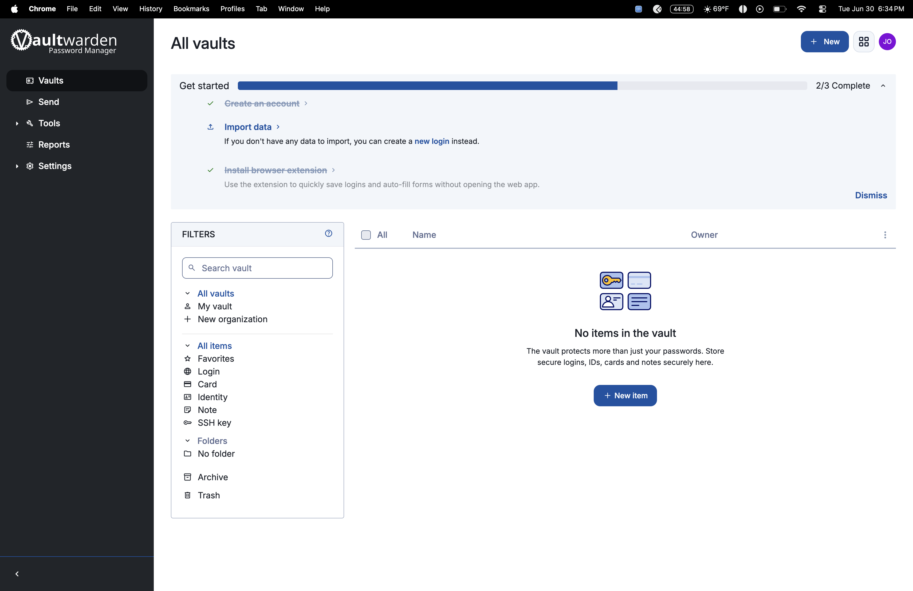

# 16 - Vaultwarden Password Manager

Self-hosted, encrypted password management server running on the Pi 5 homelab — a private alternative to Bitwarden's cloud service, with data staying entirely on local hardware.

## Problem

Cloud password managers (Bitwarden, 1Password, LastPass) store encrypted vault data on third-party servers. Even with strong encryption, that means trusting an external company's infrastructure and subscription model for something as sensitive as password storage. A self-hosted alternative keeps full control of the data while still getting a modern, cross-platform password manager experience.

## Solution

Deployed [Vaultwarden](https://github.com/dani-garcia/vaultwarden) — a lightweight, unofficial Bitwarden-compatible server written in Rust — as a single Docker container on the Pi 5. Vaultwarden implements the full Bitwarden API, so any official Bitwarden client (browser extension, mobile app, desktop app) can point at this self-hosted server instead of Bitwarden's cloud.

Exposed securely to the internet via the existing Cloudflare Tunnel setup (`jovi-pi-tunnel`), giving the vault a real HTTPS domain (`vaultwarden.jovis.casa`) without opening any inbound ports on the router. Cloudflare terminates SSL at the edge, so the connection is encrypted end-to-end without any manual certificate management.

### Docker Compose Configuration

```yaml
services:
  vaultwarden:
    image: vaultwarden/server:latest
    container_name: vaultwarden
    restart: unless-stopped
    ports:
      - "8082:80"
    volumes:
      - ./data:/data
    environment:
      - SIGNUPS_ALLOWED=false
```

- **Image**: `vaultwarden/server:latest` — official Vaultwarden Docker image
- **Port**: `8082` on the host mapped to internal port `80`
- **Volume**: `./data:/data` — persists the encrypted vault database, attachments, and config outside the container so nothing is lost on restart/rebuild
- **Environment**: `SIGNUPS_ALLOWED=false` — public registration is locked down; all needed accounts were created during initial setup, then this was flipped off to prevent open sign-ups on the public URL

### Access Points

| Method | URL |
|---|---|
| Cloudflare Tunnel (public HTTPS) | `https://vaultwarden.jovis.casa` |
| Tailscale (private) | `http://100.121.71.88:8082` |
| Local network | `http://192.168.12.239:8082` |

## Proof

**Container running healthy:**



**HTTPS confirmed via Cloudflare Tunnel:**

Verified TLS termination and valid response headers direct from Cloudflare's edge:

```bash
curl -I https://vaultwarden.jovis.casa
```


Response confirmed `HTTP/2 200`, served by `cloudflare`, with a full set of security headers (CSP, X-Frame-Options, X-Content-Type-Options, Permissions-Policy) — Vaultwarden's own hardened defaults, not something manually configured.

**Login page:**



**Vault dashboard:**



## Stack

- Docker / Docker Compose
- Vaultwarden (Rust-based Bitwarden-compatible server)
- Cloudflare Tunnel (`jovi-pi-tunnel`) for public HTTPS access
- Tailscale for private remote access

## Notes

- Data lives in `./data` on the Pi's filesystem — this directory is included in the nightly backup script alongside the other Docker volumes.
