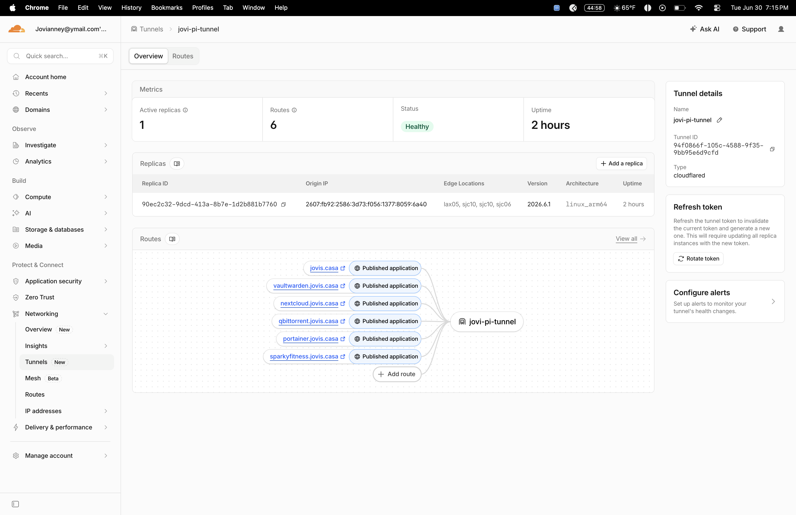
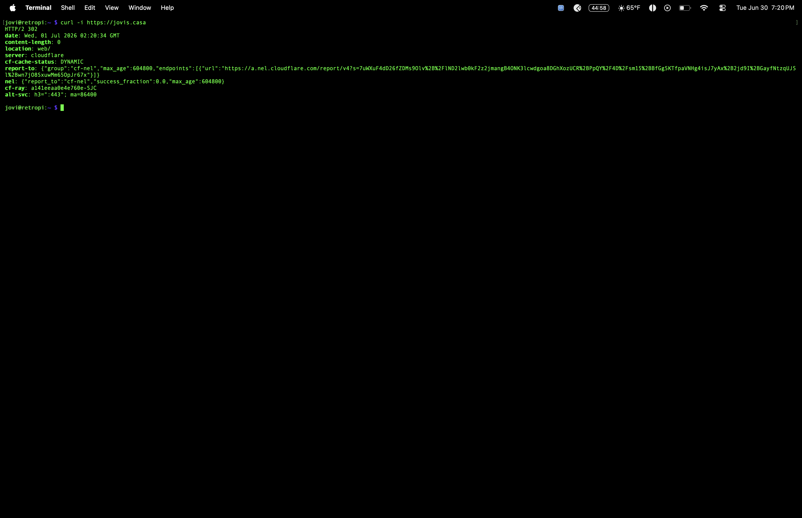

# 17 - Cloudflare Tunnel + Custom Domain

Secure public access to homelab services via Cloudflare Tunnel, using a custom domain (`jovis.casa`) instead of raw IP:port combinations — without opening a single inbound port on the home router.

## Problem

Every self-hosted service on the Pi (Jellyfin, Vaultwarden, Nextcloud, qBittorrent, Portainer, SparkyFitness) needed to be reachable from outside the home network with a clean, memorable URL instead of `http://192.168.12.239:8096` style addresses. The original plan (documented in the Level 3 master plan) called for NGINX as a reverse proxy plus Let's Encrypt for SSL certificates, requiring an open inbound port and manual certificate renewal.

## Solution

Deployed **Cloudflare Tunnel** instead of a traditional NGINX + Let's Encrypt reverse proxy. Cloudflare Tunnel creates an outbound-only encrypted connection from the Pi to Cloudflare's edge network via the `cloudflared` daemon — meaning the router never needs a single inbound port opened, and there's no public-facing attack surface for the Pi itself.

Purchased `jovis.casa` as the custom domain through Cloudflare's registrar, then published each internal service as a route through the tunnel. Cloudflare terminates SSL automatically at the edge for every published hostname — no manual certificate generation, no renewal scripts, no NGINX config files to maintain.

### How It Works

```
Internet → Cloudflare Edge (SSL termination) → Encrypted Tunnel → cloudflared (on Pi) → Local service (Jellyfin, Vaultwarden, etc.)
```

The `cloudflared` daemon runs as a systemd service on the Pi, authenticated via a tunnel token, and maintains a persistent outbound connection to Cloudflare. All routing rules (which subdomain maps to which local port) are managed remotely through the Cloudflare Zero Trust dashboard — no local YAML config file needed.

### Systemd Service

```bash
sudo systemctl status cloudflared
```

Runs as `cloudflared.service`, enabled at boot, using `cloudflared --no-autoupdate tunnel run --token <token>`.

### Published Routes

| Subdomain | Service |
|---|---|
| `jovis.casa` | Root domain / Jellyfin |
| `vaultwarden.jovis.casa` | Vaultwarden |
| `nextcloud.jovis.casa` | Nextcloud |
| `qbittorrent.jovis.casa` | qBittorrent |
| `portainer.jovis.casa` | Portainer |
| `sparkyfitness.jovis.casa` | SparkyFitness |

Tunnel name: `jovi-pi-tunnel` — 6 active routes, running on `linux_arm64`, `cloudflared` version `2026.6.1`.

## Proof

**Tunnel overview — healthy status, all routes live:**



**Full routes list:**


**cloudflared service running on the Pi:**

```bash
sudo systemctl status cloudflared
```


**HTTPS confirmed end-to-end:**

```bash
curl -i https://jovis.casa
```



Response confirmed valid SSL termination directly from Cloudflare's edge, `server: cloudflare`, with no manual certificate configuration required anywhere in the setup.

## Stack

- Cloudflare Tunnel (`cloudflared`)
- Cloudflare Zero Trust dashboard (remote route management)
- Cloudflare Registrar (`jovis.casa` domain)
- systemd (service management on the Pi)

## Why This Replaced the Original NGINX Plan

The original Level 3 plan called for NGINX as a reverse proxy with Let's Encrypt SSL certificates. Cloudflare Tunnel accomplishes the same end goal — real domain names instead of IP:port, HTTPS everywhere — with three practical advantages:

1. **No open ports** — NGINX would have required exposing port 443 on the router. Cloudflare Tunnel is fully outbound-only.
2. **No certificate management** — Let's Encrypt requires renewal automation (certbot cron jobs, etc.). Cloudflare handles SSL termination automatically for every route.
3. **Centralized management** — routes are added/edited from the Cloudflare dashboard in seconds, no SSH session or config file editing required for routing changes.

## Notes

- Route management lives entirely in the Cloudflare Zero Trust dashboard — there is no local `config.yml` on the Pi, since the tunnel is token-authenticated and remotely managed.
- Only 1 active replica is currently running. Cloudflare supports adding additional replicas for redundancy if the Pi ever needs a secondary origin.
