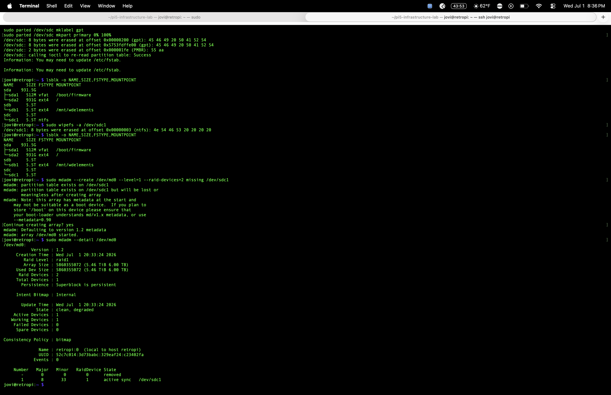
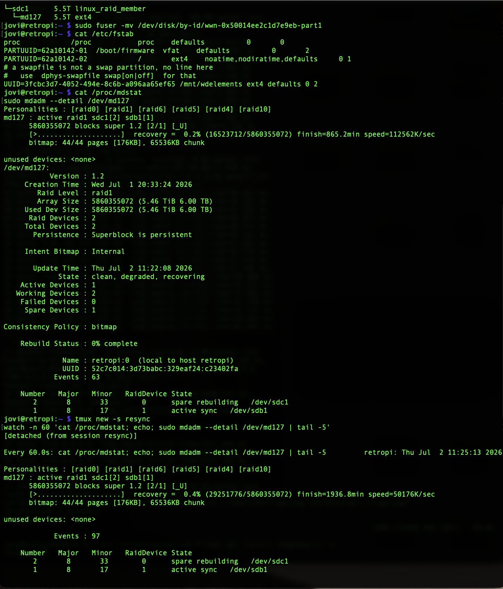
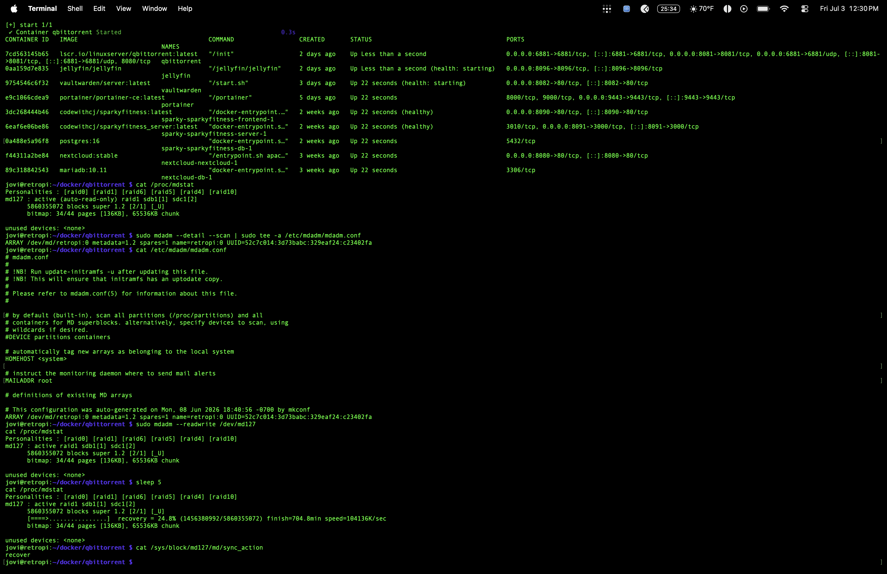
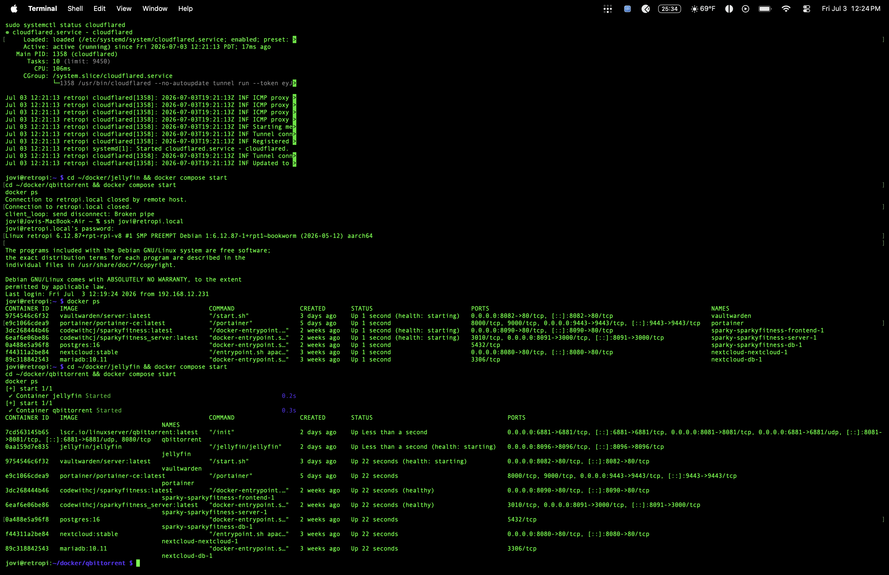

# RAID 1 — Redundant Storage

## Problem
Two separate 6TB WD Elements drives with no redundancy — if either drive 
failed, everything on it was gone. No mirroring, no fault tolerance, 
single point of failure for the entire media library.

## Solution
Built a live-mirrored RAID 1 array across both WD Elements 6TB drives 
using mdadm, so either drive can fail without any data loss. Migrated 
the existing library onto the array using the degraded-array technique 
(build with one drive, copy data over, then add the second drive to 
sync) — this avoided needing extra storage to hold a full backup during 
the conversion.

### Architecture
- 2x WD Elements 6TB → mirrored as `/dev/md127`, mounted at `/mnt/wdelements`
- T7 1TB SSD → stays separate as the Pi's boot/root drive, not part of the array
- `mdadm.conf` registered with the array's persistent UUID for reliable 
  reassembly on every boot
- `nofail` added to relevant fstab entries so a failed mount degrades 
  the boot instead of blocking it

### Build steps
1. Partitioned and wiped the second WD Elements drive (`sdc1`)
2. Created the array in degraded mode: `mdadm --create /dev/md0 --level=1 
   --raid-devices=2 missing /dev/sdc1`
3. Formatted the array (`mkfs.ext4`), mounted temporarily
4. Migrated existing library (movies/shows) from the first drive onto 
   the new array via `rsync --sparse` (preserves sparse file holes from 
   qBittorrent pre-allocation)
5. Added the first drive into the array: `mdadm --add /dev/md0 /dev/sdb1` 
   — mdadm auto-synced it to match, completing the mirror
6. Registered the array in `/etc/mdadm/mdadm.conf`, rebuilt initramfs
7. Repointed `/mnt/wdelements` at the RAID array's real filesystem UUID

### Result
md127 : active raid1 sdc1[2] sdb1[1]
5860355072 blocks super 1.2 [2/2] [UU]
State : clean
Both drives fully synced. Real, live RAID 1 mirror — either drive can 
die without losing data.

## Proof

![Final synced state — clean, [UU]](screenshots/raid1-mdadm-detail-clean-synced.png)

## Lessons learned
See `failures.md` for the full breakdown — six distinct real incidents 
across boot-level USB enumeration, filesystem corruption, stale configs, 
and stale container mounts.

## Resume line
"Designed and recovered a multi-drive RAID 1 array through six real-world 
failures spanning bootloader-level USB issues, filesystem corruption, and 
stale system configs — diagnosing and resolving each at the correct layer 
of the stack, from firmware to container runtime."