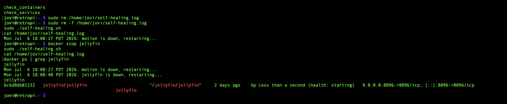

markdown# Self-Healing Automation Script

## Problem

Docker containers and core system services on retropi would occasionally 
crash or stop (confirmed pattern: the `motion` service repeatedly failing 
its RTSP camera connection). Without monitoring, these outages went 
unnoticed until manually checking — no visibility, no automatic recovery, 
no alerting.

## Goal

Build a script that checks Docker containers and core system services on a 
schedule, automatically restarts anything that's down, logs the event, and 
sends an email alert — all without manual intervention.

## Solution

### 1. Wrote the monitoring/recovery script

`/home/jovi/self-healing.sh` loops through a list of Docker containers and 
system services, checks each one's actual running status, and if anything's 
down: restarts it, logs the timestamp and action, and fires an email alert.

Watches:
- **Containers:** jellyfin, qbittorrent, vaultwarden, portainer, navidrome, 
  audiobookshelf, SparkyFitness (frontend/server/db), Nextcloud (app/db)
- **Services:** rsyslog, ufw, fail2ban, motion

### 2. First run surfaced real config mistakes

Initial container names were guessed based on the service, not the actual 
Docker container names. Running `docker ps -a` showed the real names — 
notably that SparkyFitness runs as three separate containers 
(docker-compose naming pattern: `sparky-sparkyfitness-frontend-1`, etc.), 
and `motioneye` isn't a Docker container at all — it's the native `motion` 
systemd service. Fixed the script's arrays to match reality.

### 3. Proved the self-healing actually works

Manually killed Jellyfin to simulate a crash, ran the script, and confirmed 
detection, restart, and logging all happened correctly:



### 4. Automated with cron

```bash
*/5 * * * * /home/jovi/self-healing.sh
```

Runs every 5 minutes with zero manual intervention needed going forward.

### 5. Built the email alerting pipeline

The script uses the system `mail` command, which relies on Postfix by 
default — but Postfix was installed and never actually running (confirmed 
via `mailq`: "Connection refused"). Rather than fight Postfix's full 
internet-relay configuration, installed and configured `msmtp` — a 
lightweight tool built specifically for relaying through an existing SMTP 
provider (Gmail).

Configured `~/.msmtprc` with Gmail SMTP + an App Password (not a real 
account password — Google blocks that for security), then pointed the 
system `mail` command at msmtp instead of the broken Postfix by adding one 
line to `/etc/mail.rc`:
set sendmail="/usr/bin/msmtp"

Confirmed delivery with proper email headers:


## Result

Self-healing automation is live: Docker containers and core services are 
checked every 5 minutes, auto-restarted on failure, logged, and alerted via 
email. This closes the loop on manual monitoring for the homelab.