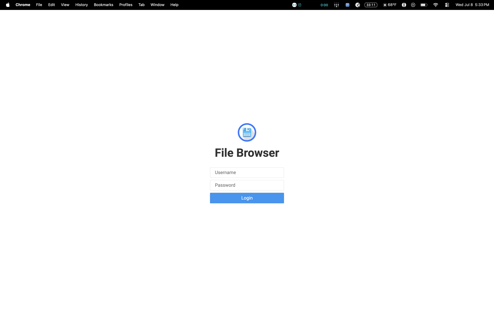
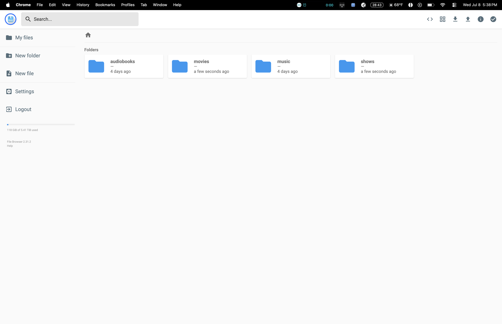
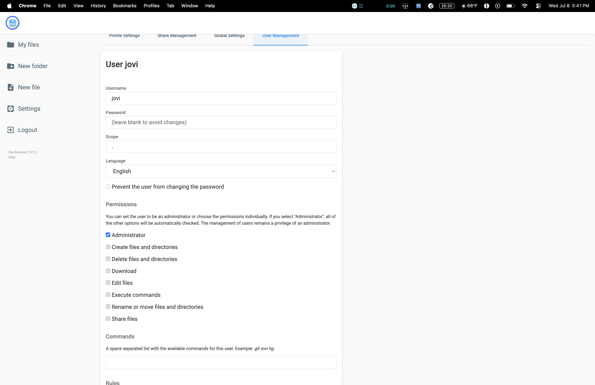
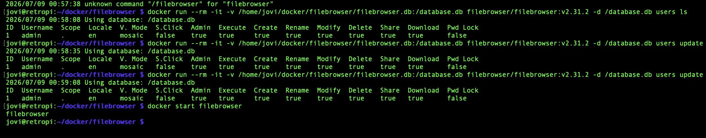
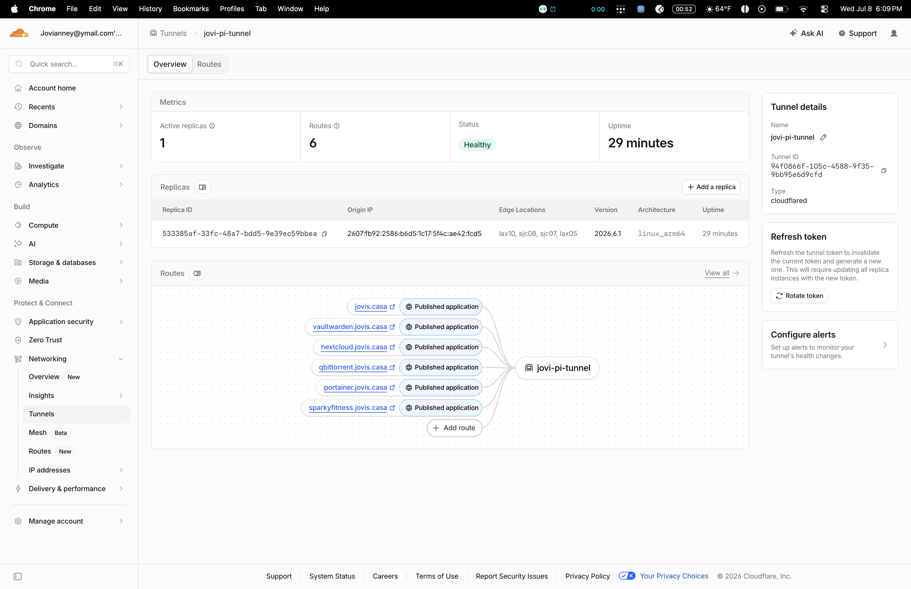
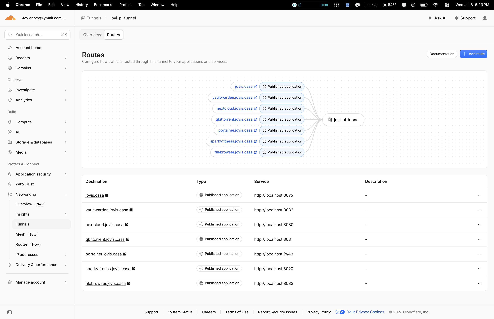

# Filebrowser — Web File Management UI

## Problem
The WD Elements RAID 1 array (`/mnt/wdelements`) could only be browsed
two ways: SSH'd into the Pi typing `ls`/`cd` commands, or mounted over
Samba in Finder on the Mac — which only works on the home network.
No easy way to see what's on the drives, spot duplicates, or manage
files from a phone or any browser, from anywhere.

## Solution
Deployed Filebrowser — a lightweight, self-hosted, Google-Drive-style
web interface — in Docker, pointed directly at the RAID array. Exposed
it through the existing Cloudflare Zero Trust Tunnel at
`filebrowser.jovis.casa`, matching the same pattern used for every
other service in the stack (Jellyfin, Vaultwarden, Nextcloud, etc).

### Architecture
- Container: `filebrowser/filebrowser:v2.31.2` (pinned — see failures.md
  for why `latest` was a problem on ARM64)
- Volume 1: `/mnt/wdelements:/srv` — the actual RAID array, read/write
- Volume 2: `/home/jovi/docker/filebrowser/filebrowser.db:/database.db`
  — persists users/settings outside the container
- Port: `8083:80`
- Access: `https://filebrowser.jovis.casa` via existing Cloudflare Tunnel
  (published application → `http://localhost:8083`)

### Build steps
1. Created `~/docker/filebrowser/` following the same folder pattern as
   every other service in the stack
2. Pre-created an empty `filebrowser.db` file with `touch` before first
   run — without this, Docker mounts a *folder* instead of a *file* at
   that path and the app breaks
3. Wrote `docker-compose.yml` mounting the RAID array to `/srv` and the
   database file to the app's expected database path
4. Opened UFW port `8083/tcp`
5. Added a new Published Application route in the Cloudflare Zero Trust
   dashboard: `filebrowser.jovis.casa` → `http://localhost:8083`

## Result
Full drag-and-drop file management for the entire RAID array, from any
browser, on any device, from anywhere — no Samba mount, no SSH required.
118 GB of 5.41 TiB currently visible and manageable through the UI.

## Proof

## Resume Line
"Deployed a self-hosted file management web interface for remote NAS
administration, containerized with Docker and exposed securely via
Cloudflare Zero Trust Tunnel with a custom domain"
