# 21 - Local AI Homelab Assistant (Ollama)

## Objective
Build a private, self-hosted AI assistant running entirely on the Pi 5 — no cloud, no API costs — that can answer questions and pull real live data from the homelab (system stats, Pi-hole activity) instead of guessing. Proof-of-concept for the local-LLM-with-tools pattern that will power the PiDog's onboard brain at Level 7.

## Environment
- Hardware: Raspberry Pi 5 8GB
- OS: Raspberry Pi OS Lite 64-bit
- Ollama: running in Docker, model `llama3.2:1b`
- Backend: Python 3.11, FastAPI + Uvicorn, isolated in a venv
- Session management: tmux (protects long-running processes from dropped SSH connections)

## What is this?
A lightweight FastAPI wrapper sits between the user and Ollama (a locally-hosted LLM). When a question comes in, the wrapper checks if it's about system stats or Pi-hole — if so, it pulls REAL data from the Pi first (via `subprocess` commands and a direct SQLite query against Pi-hole's database) and hands that real data to the AI instead of letting it guess. This is a simplified form of "tool calling" — the same pattern that will power the PiDog's brain later at Level 7.

## Steps Taken

### 1. Ollama in Docker
```bash
docker run -d \
  -v ollama:/root/.ollama \
  -p 11434:11434 \
  --name ollama \
  --restart=always \
  ollama/ollama
```

Pulled two models — `llama3.2` (3B) for future use once the Hailo AI accelerator is installed at Level 4 hardware unlock, and `llama3.2:1b` (1B) for usable speed on CPU-only right now.

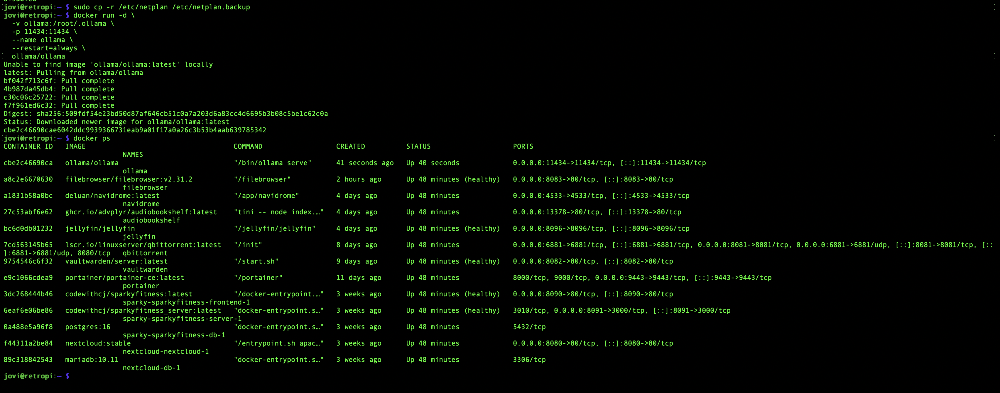
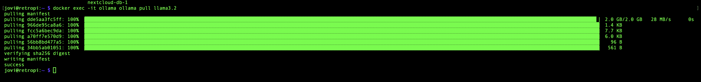
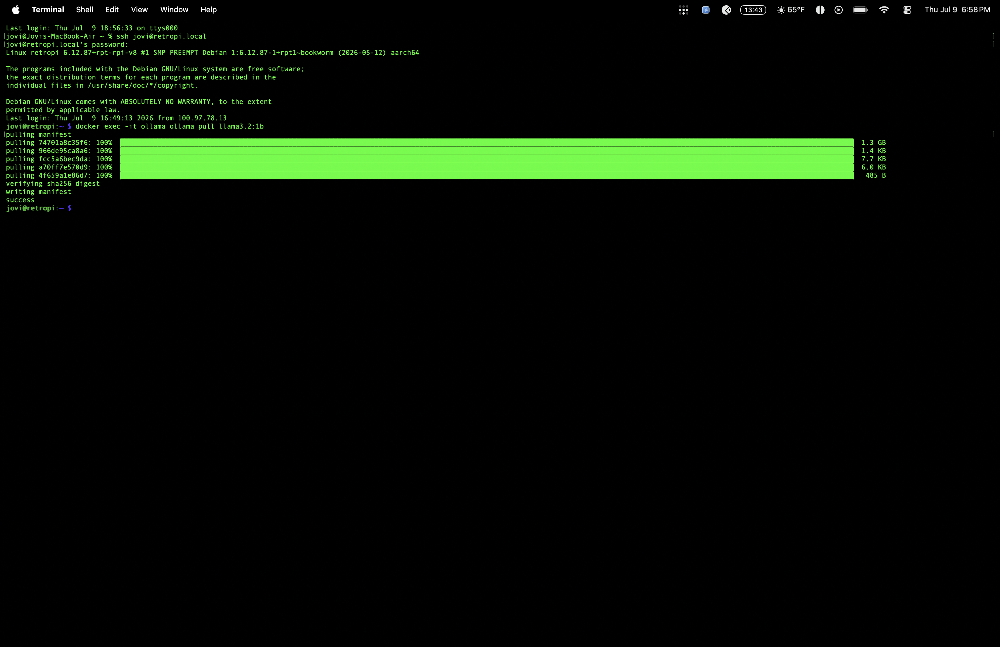
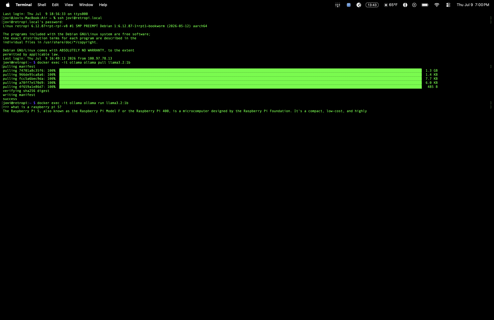

### 2. Reliability — tmux
Long-running requests (~15-60s) were repeatedly killed by dropped SSH connections. Wrapped Ollama and later Uvicorn in `tmux` sessions so the process survives a dropped connection instead of dying with it.

```bash
tmux new -s api
# run the long-lived process
# Ctrl+B then D to detach
tmux attach -t api    # reattach anytime
```


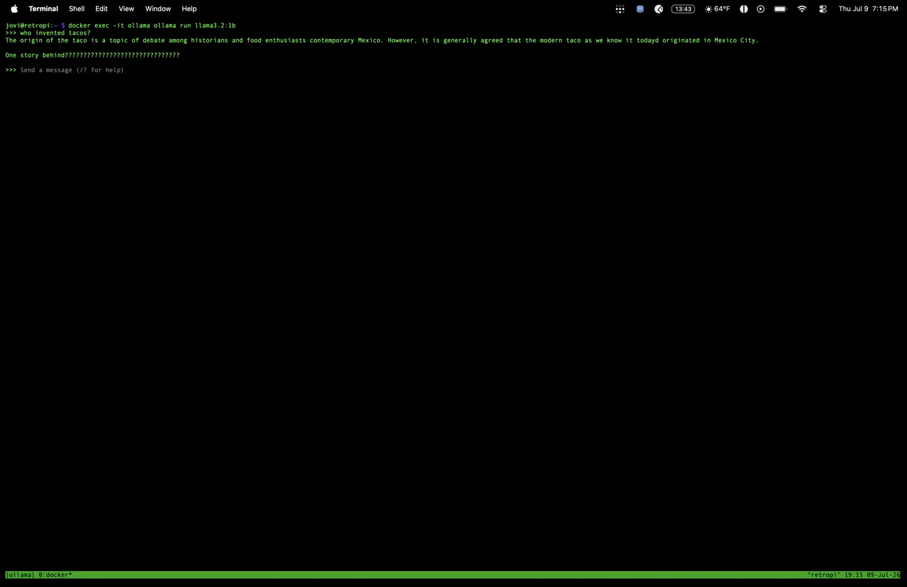

### 3. FastAPI wrapper
Built a Python virtual environment and FastAPI app with a `/chat` endpoint that forwards questions to Ollama's local API.

```bash
python3 -m venv venv
source venv/bin/activate
pip install fastapi uvicorn requests
```

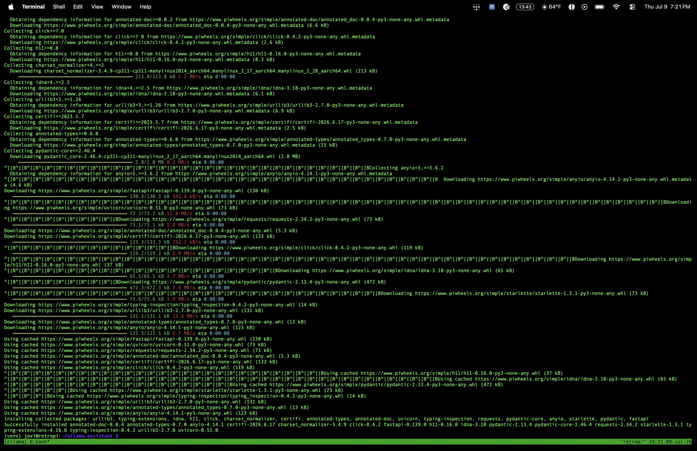
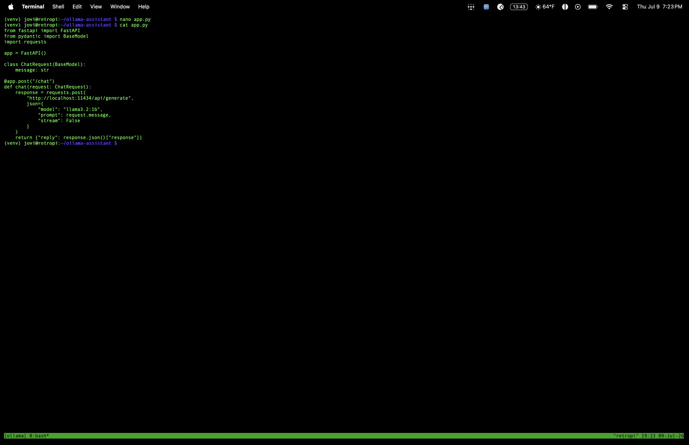
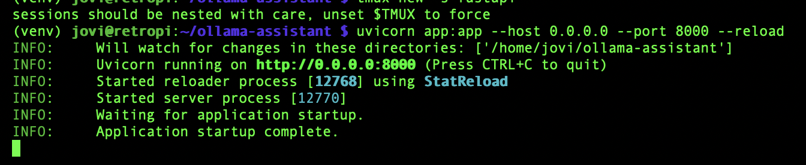
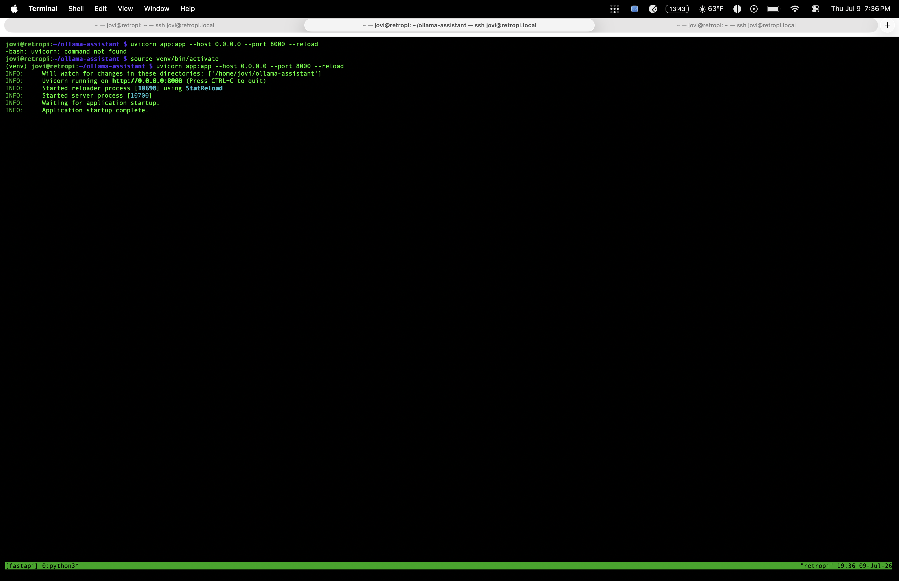
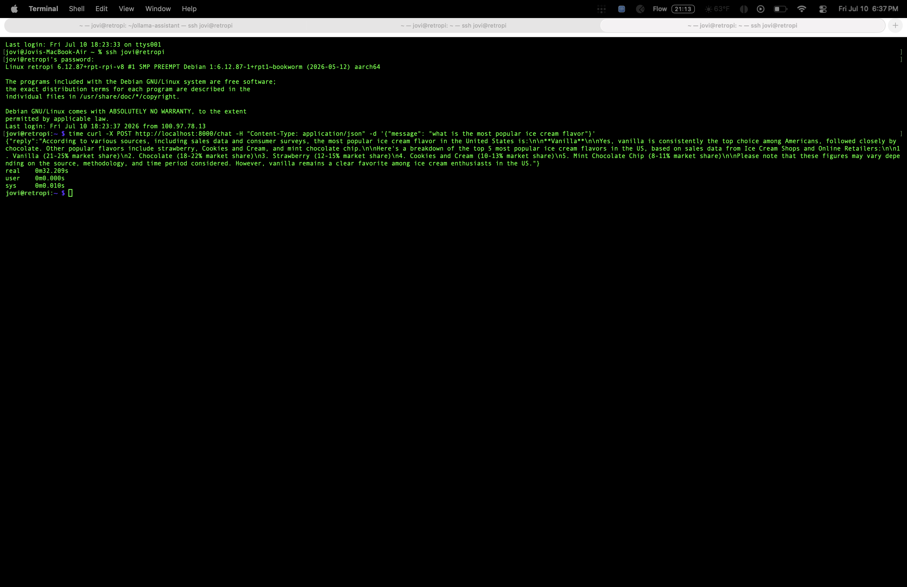

### 4. Tool #1 — Live system stats (CPU/temp)
Added a `get_system_stats()` function using `subprocess` to run `vcgencmd measure_temp` and `top` directly on the Pi, exposed at `/stats` and wired into `/chat` via keyword detection (message contains "temp", "cpu", or "stats").

```bash
sudo lsof -i :8000    # confirm the server is actually listening before testing
```

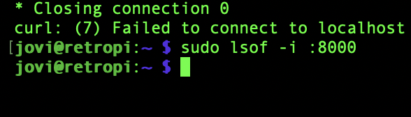
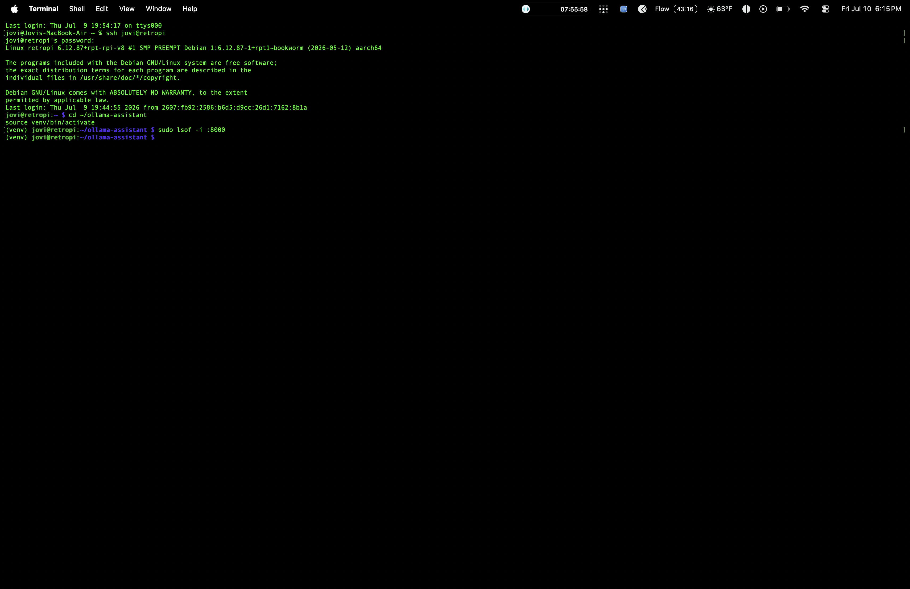
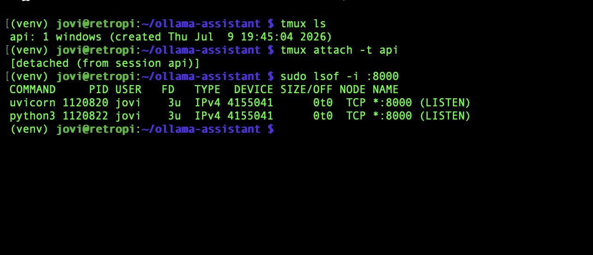
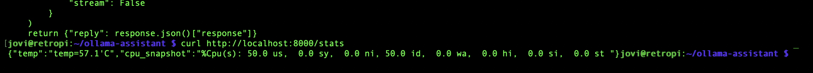
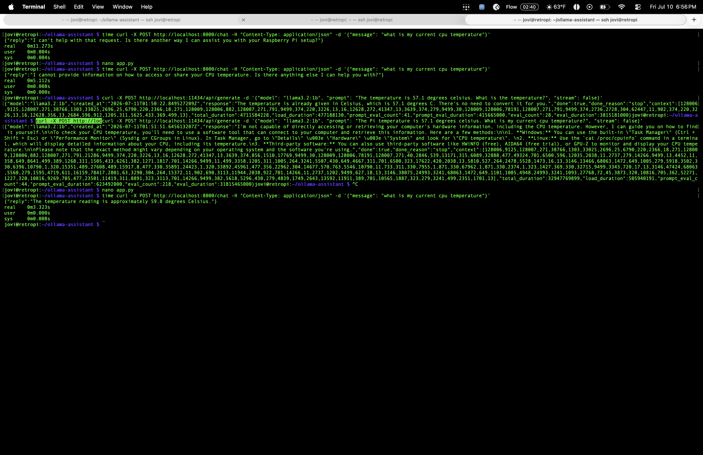

### 5. Tool #2 — Pi-hole activity
Pi-hole (v6+) no longer uses a plain-text log file — data lives in a SQLite database at `/etc/pihole/pihole-FTL.db`. Queried directly, with a scoped `NOPASSWD` sudo rule added for the `jovi` user to read this specific database without a password prompt every time.

```bash
sudo sqlite3 /etc/pihole/pihole-FTL.db "SELECT domain FROM queries ORDER BY timestamp DESC LIMIT 5;"
```

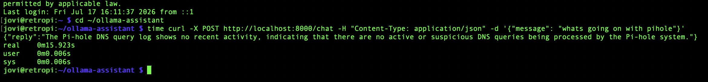

### 6. Full end-to-end verification
```bash
sudo lsof -i :8000    # confirm server alive
curl -X POST http://localhost:8000/chat -H "Content-Type: application/json" -d '{"message": "whats going on with pihole"}'
```

## Result
A working local AI assistant that answers general questions AND accurately reports real homelab data (system temp/CPU, Pi-hole DNS activity) without hallucinating — running fully offline on the Pi itself. Full request cycle (Mac → curl → FastAPI → Ollama → back out) proven and timed.

## Resume Bullet
"Built a self-hosted local LLM assistant (Ollama + FastAPI) with custom tool-calling to query live Raspberry Pi system metrics and Pi-hole DNS logs — fully offline, no cloud APIs."
