# 22 — Grafana + Prometheus Monitoring Stack

Full observability stack for the Pi 5 homelab — real-time dashboards for system health, network storage, and DNS/ad-blocking stats, all self-hosted and exposed securely via Cloudflare Tunnel.

## Problem

Running 14+ Docker containers and a native Pi-hole install with zero visibility into system health. No way to see CPU/memory trends over time, catch a service quietly degrading, or confirm Pi-hole's actually blocking what it claims to be blocking — just a snapshot in each service's own dashboard, no historical data, no single pane of glass.

## Solution

Deployed a three-piece monitoring pipeline using Docker Compose:

- **Node Exporter** — reads the Pi's raw hardware vitals (CPU, memory, disk, network, temperature)
- **Prometheus** — scrapes and stores that data on a 15-second interval, plus scrapes Pi-hole stats via a dedicated exporter
- **Grafana** — visualizes everything through the community "Node Exporter Full" dashboard (ID 1860) and a custom Pi-hole Exporter dashboard

Added **Pi-hole stats** via `ekofr/pihole-exporter`, authenticating against Pi-hole's v6 API with an app password over HTTPS.

### Docker Compose Configuration

```yaml
services:
  node-exporter:
    image: prom/node-exporter:latest
    container_name: node-exporter
    restart: unless-stopped
    network_mode: "host"
    volumes:
      - /proc:/host/proc:ro
      - /sys:/host/sys:ro
      - /:/rootfs:ro
    command:
      - '--path.procfs=/host/proc'
      - '--path.sysfs=/host/sys'
      - '--collector.filesystem.mount-points-exclude=^/(sys|proc|dev|host|etc)($$|/)'

  prometheus:
    image: prom/prometheus:latest
    container_name: prometheus
    restart: unless-stopped
    network_mode: "host"
    volumes:
      - ./prometheus/prometheus.yml:/etc/prometheus/prometheus.yml
      - prometheus-data:/prometheus
    depends_on:
      - node-exporter

  grafana:
    image: grafana/grafana:latest
    container_name: grafana
    restart: unless-stopped
    network_mode: "host"
    volumes:
      - grafana-data:/var/lib/grafana
    depends_on:
      - prometheus

  pihole-exporter:
    image: ekofr/pihole-exporter:latest
    container_name: pihole-exporter
    restart: unless-stopped
    network_mode: "host"
    extra_hosts:
      - "pi.hole:192.168.12.239"
    environment:
      - PIHOLE_HOSTNAME=pi.hole
      - PIHOLE_PASSWORD=${PIHOLE_APP_PASSWORD}
      - PIHOLE_PORT=443
      - PIHOLE_PROTOCOL=https
      - SKIP_TLS_VERIFICATION=true
      - INTERVAL=30s
    depends_on:
      - prometheus

volumes:
  prometheus-data:
  grafana-data:
```

- **`network_mode: "host"`** on every service — the whole stack runs on the Pi's real network stack directly instead of Docker's isolated bridge network. Required because the bridge network couldn't reach LAN IPs at all on this Pi's setup (see `failures.md`).
- **`extra_hosts`** maps `pi.hole` to Pi-hole's LAN IP inside the exporter container, so its self-signed TLS certificate (issued for the hostname `pi.hole`, not an IP) validates correctly.
- **`SKIP_TLS_VERIFICATION=true`** — the correct env var for this exporter to bypass self-signed cert trust issues (not `SSL_SKIP_VERIFY`, a naming assumption that cost real debugging time).

### Access Points

| Method | URL |
|---|---|
| Cloudflare Tunnel (public HTTPS) | `https://grafana.jovis.casa` |
| Cloudflare Tunnel — Prometheus | `https://prometheus.jovis.casa` (Cloudflare Access-gated) |
| Cloudflare Tunnel — Pi-hole | `https://pihole.jovis.casa` (Cloudflare Access-gated) |
| Tailscale (private) | `http://100.121.71.88:3000` |
| Local network | `http://192.168.12.239:3000` |

### Security — Cloudflare Access

Prometheus has zero built-in authentication, and Pi-hole's admin panel controls network-wide DNS — both were locked behind a **Cloudflare Access** policy (`Jovi Only`, email-based one-time-passcode) requiring identity verification before the login page is even reachable, on top of each service's own login.

## Proof

**Full Docker stack running clean:**

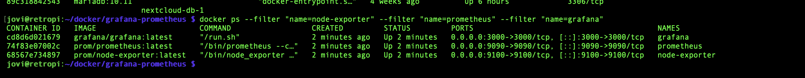

**Prometheus confirming all three targets healthy:**

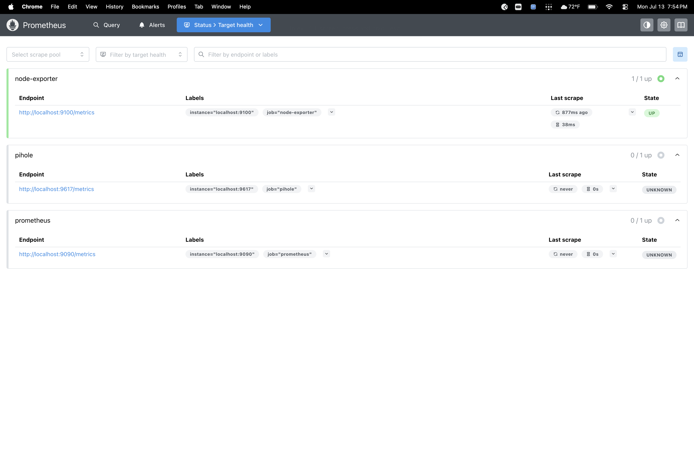

**Grafana deployed and connected to Prometheus:**

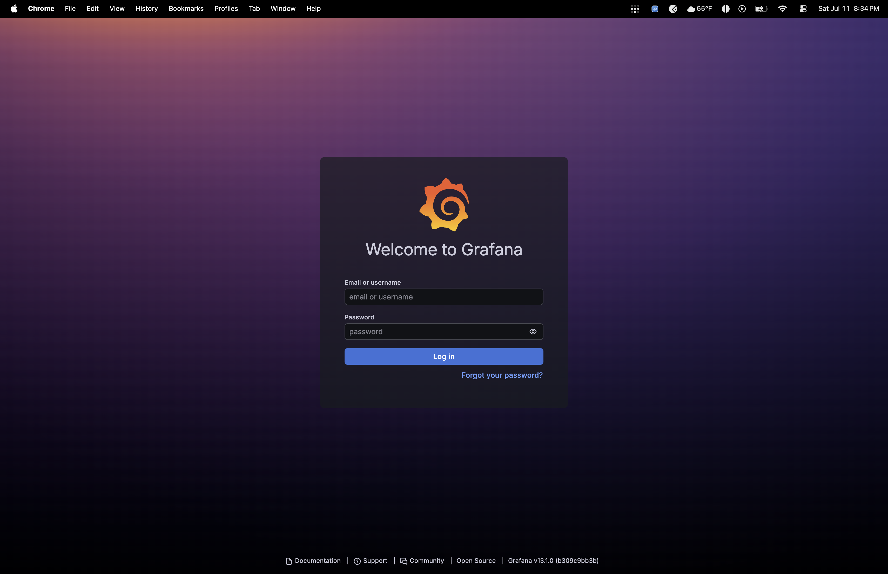
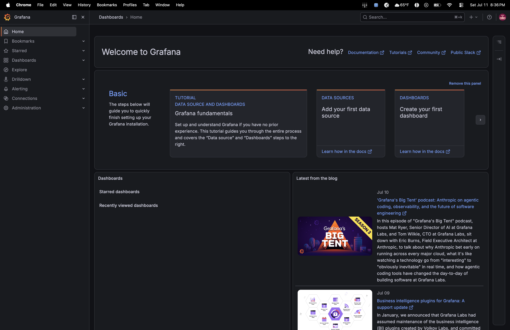
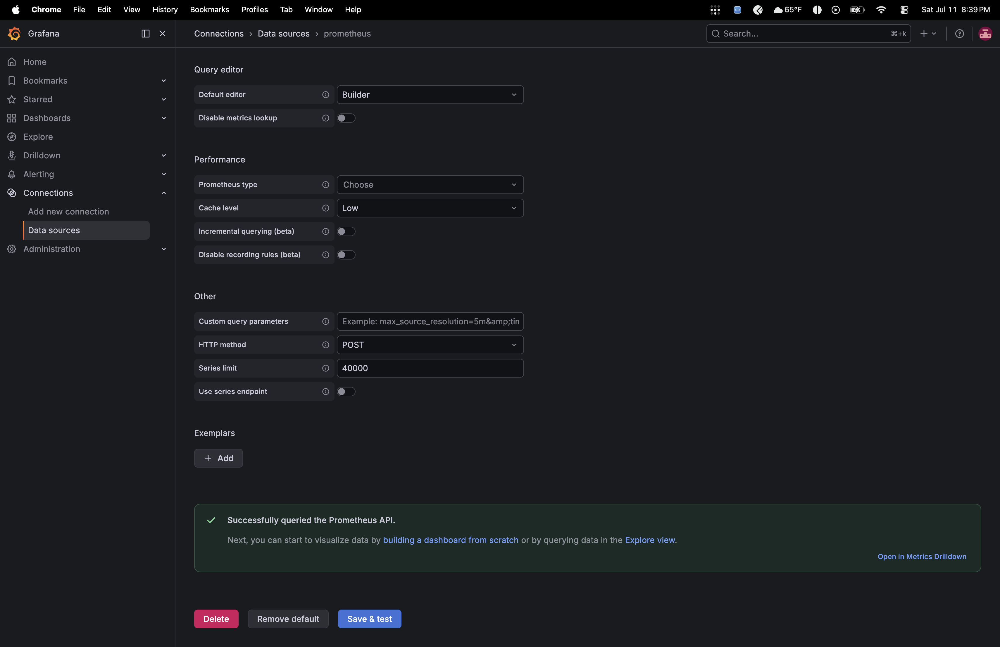

**System health dashboard — live CPU, memory, network:**

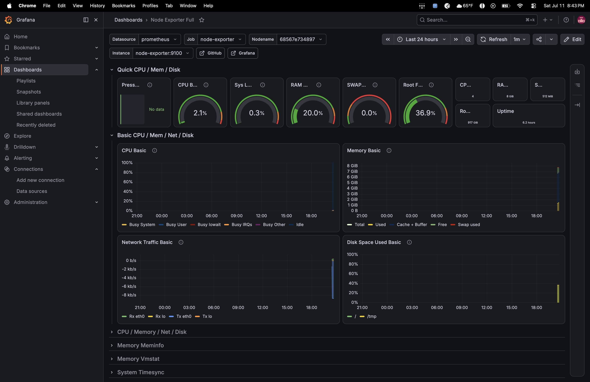

**Thermal monitoring — active cooler holding steady under load:**

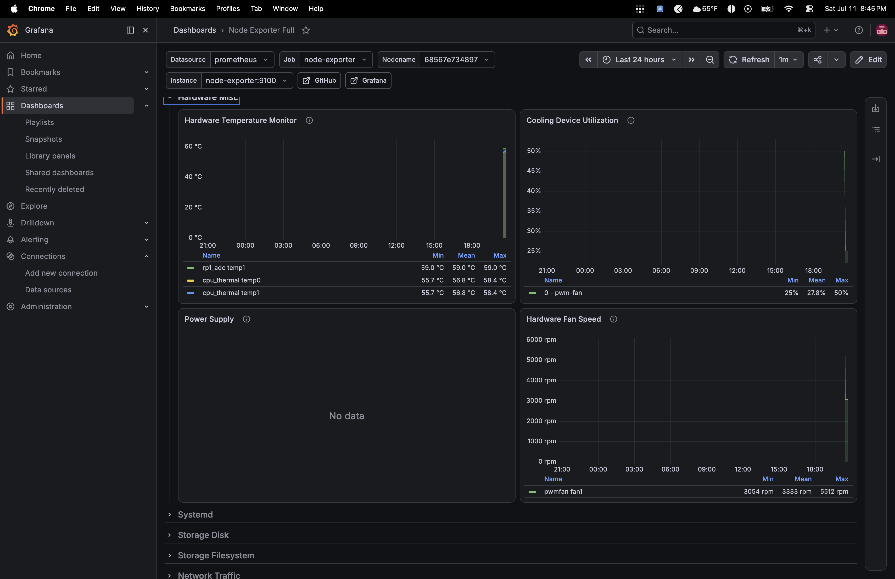

**Storage array read/write activity:**

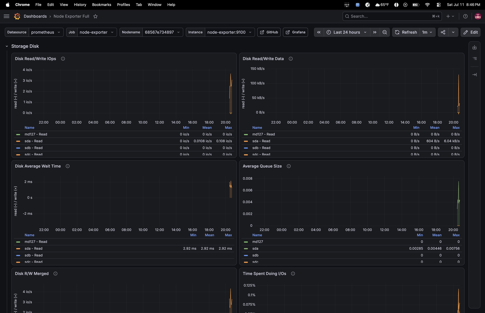

**Pi-hole dashboard import:**

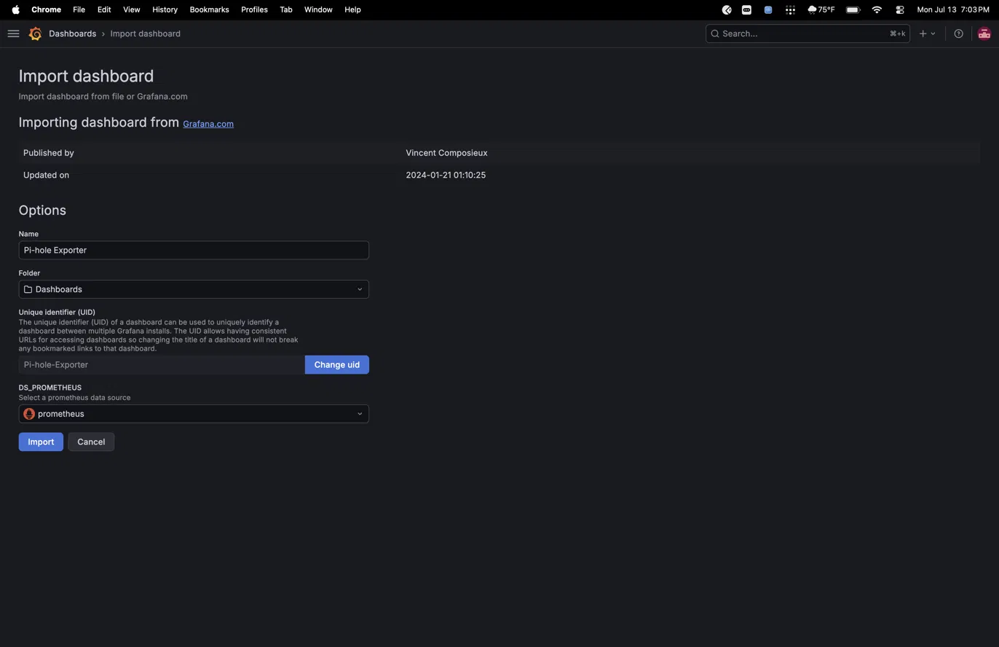

Initial import showed no data — traced through a seven-layer debugging chain (full writeup in `failures.md`) before landing on a fully live dashboard:

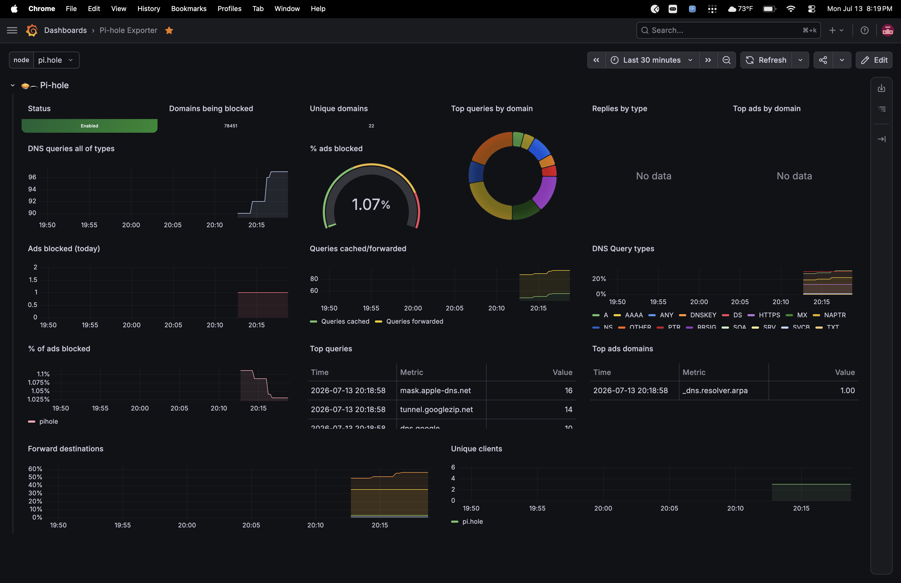

**Public subdomain routing via Cloudflare Tunnel:**

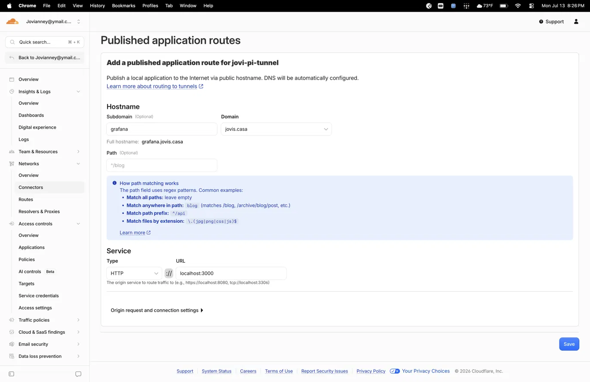
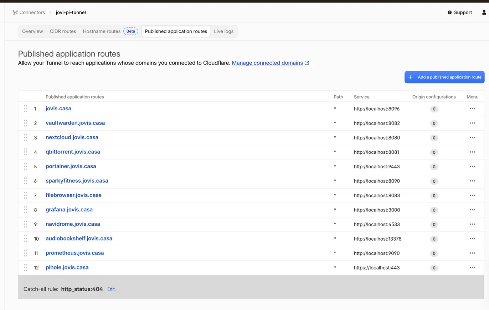

**Cloudflare Access policies protecting Pi-hole and Prometheus:**

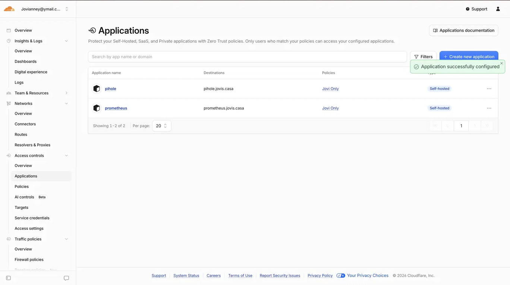

## Lessons Learned

- A clean container startup with zero error logs doesn't guarantee a working service — always confirm the *data*, not just the process status
- Docker's bridge network isn't guaranteed to reach the LAN the host is on; `network_mode: host` sidesteps this entirely on setups where it's an issue
- Self-signed certificates validate against the hostname in their SAN field, not IP addresses — `extra_hosts` is the fix when you can't use real DNS
- Always verify an env var's exact name against the project's actual docs/source before assuming a "standard" name works across different tools
- `nano` over SSH intermittently mangles YAML indentation on multi-line pastes; `cat > file << 'EOF'` is a reliable, repeatable alternative for anything YAML
- Services exposed publicly with no built-in auth (like Prometheus) need an external auth layer — Cloudflare Access closes that gap without touching the app itself

## Resume Line

"Deployed a full Prometheus/Grafana monitoring stack with custom Pi-hole DNS metrics integration on a Raspberry Pi 5, diagnosing and resolving a multi-layer networking and authentication failure chain spanning DNS service conflicts, Docker bridge networking limitations, and TLS certificate validation — exposed securely via Cloudflare Zero Trust Tunnel with Access-based authentication"
