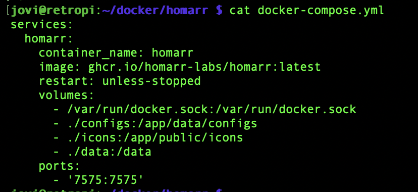
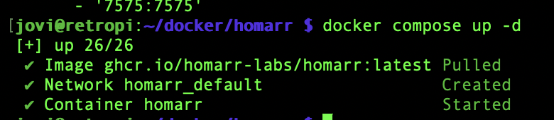
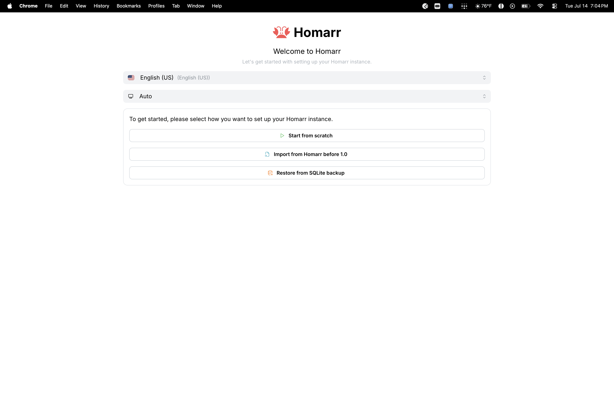
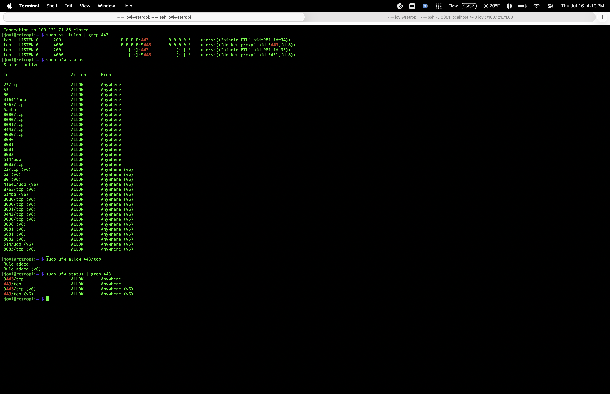
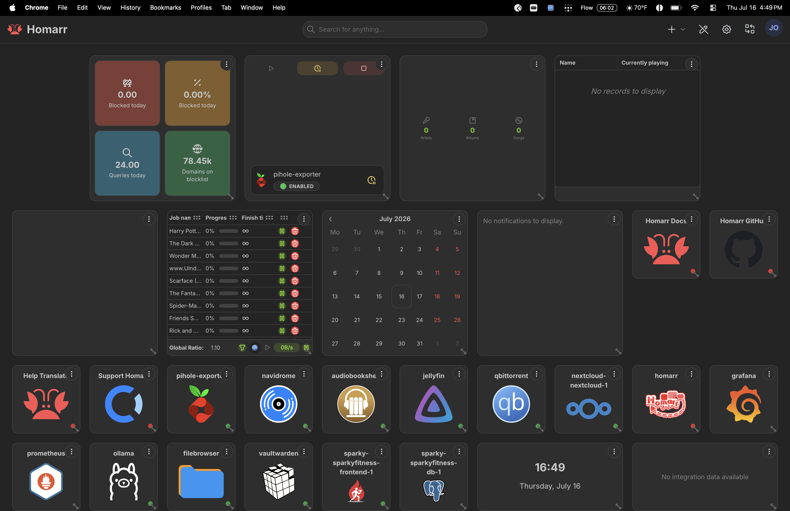
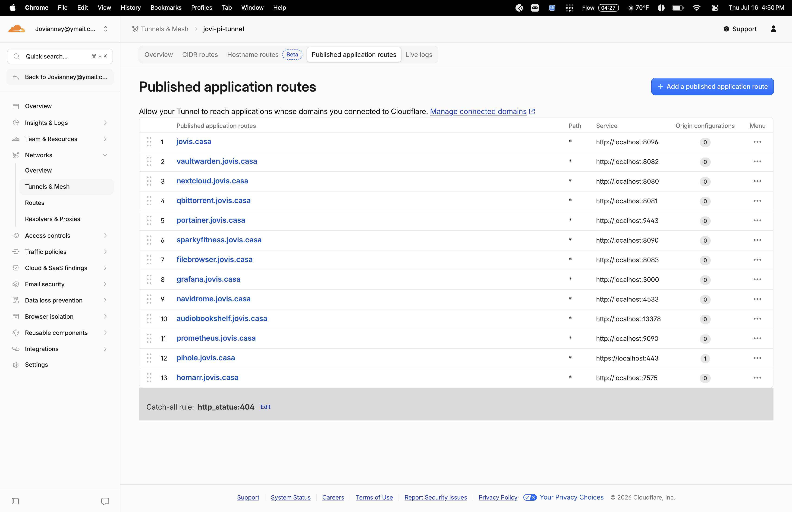

# Homarr Dashboard 🏠

## What I Built
Deployed Homarr as a centralized homepage for the entire homelab — one 
dashboard linking all 14 running services (Jellyfin, Pi-hole, Nextcloud, 
qBittorrent, Navidrome, Audiobookshelf, Grafana, Prometheus, Vaultwarden, 
Filebrowser, Ollama, and the SparkyFitness stack), with live stats pulled 
directly from each service via Docker socket auto-detection.

Accessible locally over Tailscale and publicly at `homarr.jovis.casa` via 
Cloudflare Zero Trust Tunnel.

---

## Stack
| Component | Details |
|---|---|
| Dashboard | Homarr (`ghcr.io/homarr-labs/homarr:latest`) |
| Host | Raspberry Pi 5 (retropi) |
| Port | 7575 |
| Remote access | Tailscale VPN |
| Public access | Cloudflare Zero Trust Tunnel — `homarr.jovis.casa` |
| Auto-detection | Docker socket mount — found 14 running containers, 6 with built-in integrations |

---

## What This Does
- Single homepage showing every self-hosted service with live status
- Auto-detected containers via Docker socket — no manual URL entry for basic tiles
- Live integration widgets for Pi-hole (blocked queries/domains), 
  qBittorrent (active torrents, ratio), Navidrome (library stats), 
  Jellyfin (media), Nextcloud, and Audiobookshelf
- Reachable from anywhere via Tailscale IP or public domain

---

## Setup Steps

### 1. Docker Compose
Built the stack in `~/docker/homarr/docker-compose.yml` using heredoc to 
avoid nano's SSH auto-indent YAML issues:

```bash
mkdir -p ~/docker/homarr && cd ~/docker/homarr
```

```yaml
services:
  homarr:
    container_name: homarr
    image: ghcr.io/homarr-labs/homarr:latest
    restart: unless-stopped
    environment:
      - SECRET_ENCRYPTION_KEY=<generated via openssl rand -hex 32>
    volumes:
      - /var/run/docker.sock:/var/run/docker.sock
      - ./configs:/app/data/configs
      - ./icons:/app/public/icons
      - ./data:/data
    ports:
      - '7575:7575'
```

The `docker.sock` mount is what lets Homarr auto-detect the other 
containers on the Pi instead of manually adding every tile by hand.

### 2. Launch
```bash
docker compose up -d
```

### 3. Onboarding — Integrations
Walked through Homarr's setup wizard, connecting live integrations for 
Pi-hole, Navidrome, Jellyfin, Audiobookshelf, qBittorrent, and Nextcloud 
using each service's app password/API key/login.

### 4. Cloudflare Tunnel Route
Published `homarr.jovis.casa` pointing to `localhost:7575` (plain HTTP — 
Homarr doesn't run its own TLS cert internally).

---

## Screenshots

### Compose File


### Container Started


### Welcome / Setup Screen


### Pi-hole Working Over Tailscale


### Nextcloud Public Domain Working


### Full Dashboard — Fully Configured


### Live on Cloudflare Tunnel


---

## Lessons Learned
See `failures.md` for the full breakdown — four real incidents spanning a 
missing required environment variable, a firewall port that was never 
opened, a config value overwrite, and self-signed certificate handling 
across two different services (Cloudflare Tunnel and Homarr itself).

---

## Resume Line
"Deployed a centralized homelab dashboard (Homarr) with live service 
monitoring across 14 self-hosted containers, using Docker socket 
auto-detection for service discovery, exposed securely via Tailscale VPN 
and Cloudflare Zero Trust Tunnel with a custom domain."
