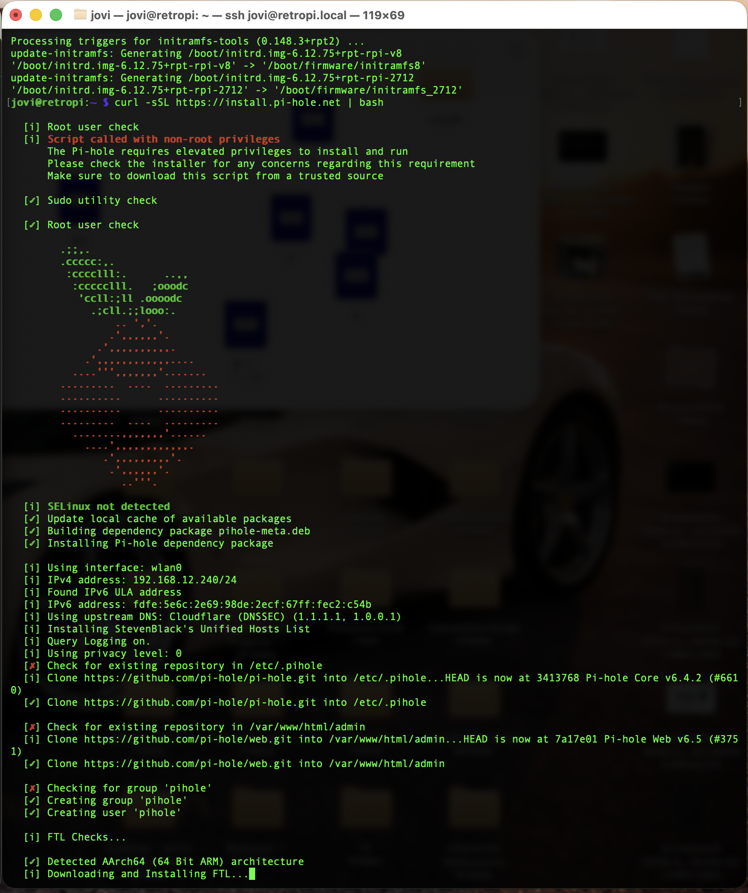
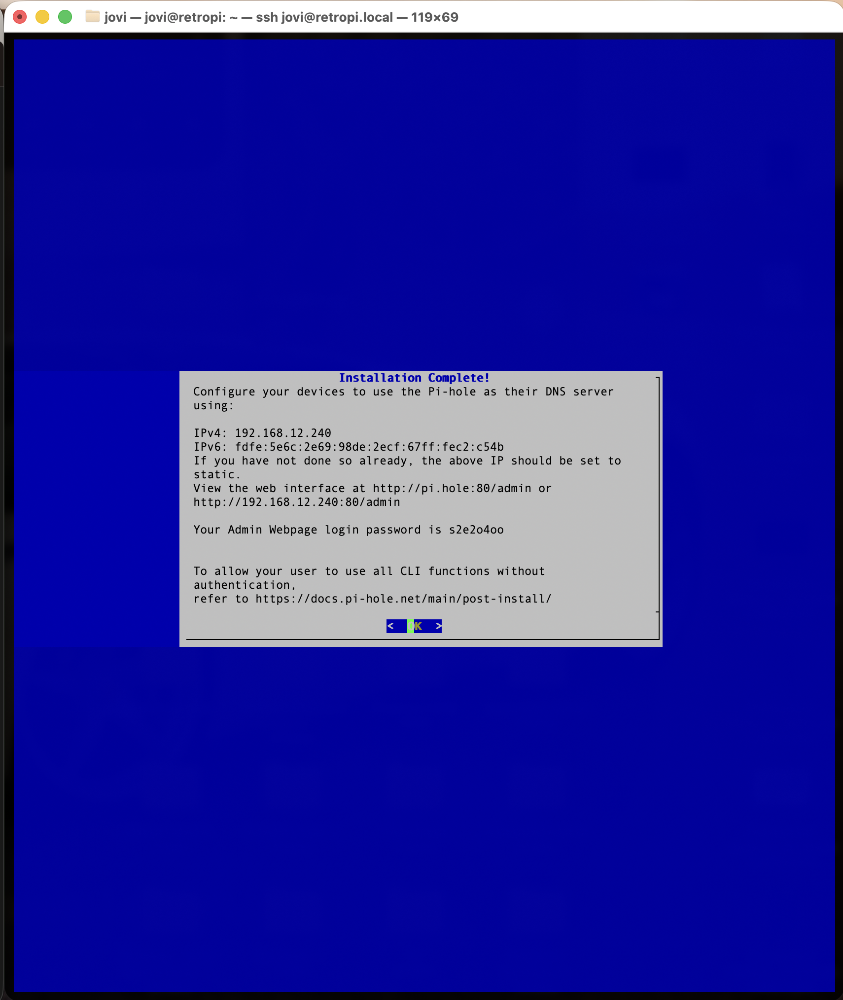
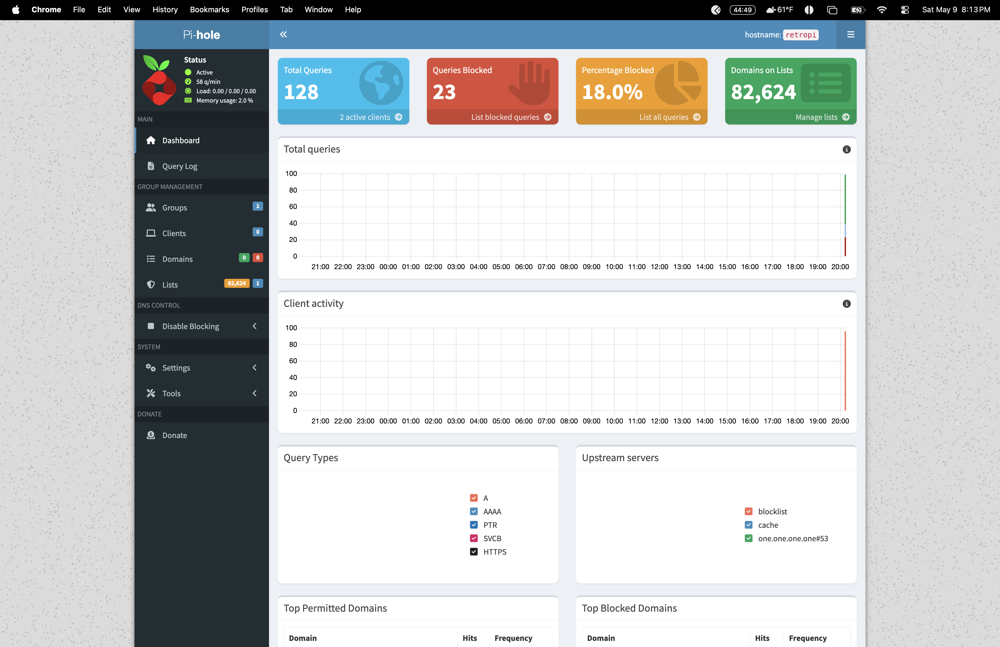
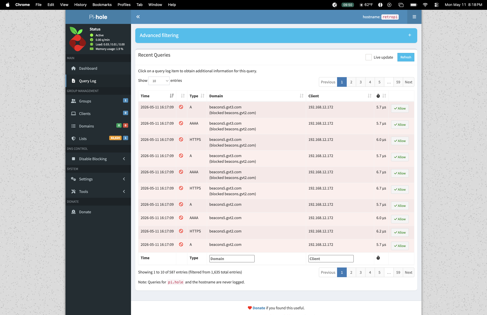
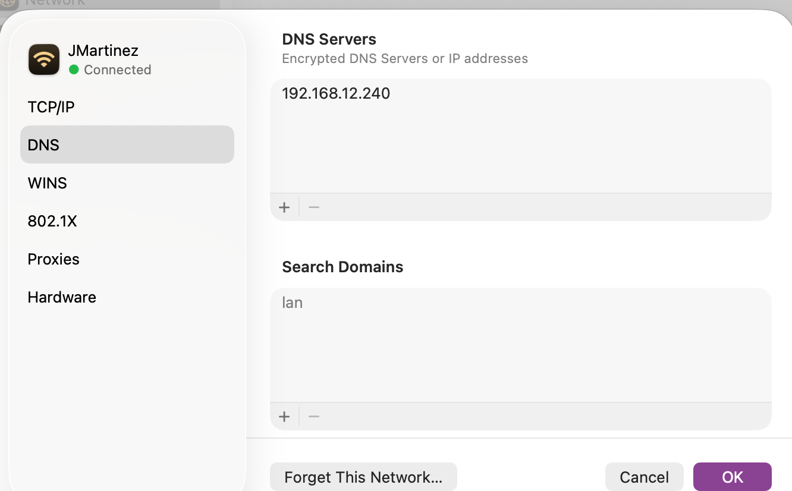

# Pi 5 Infrastructure Lab

## Objective
Deployed a headless Linux server on a Raspberry Pi 5 to manage 
network-wide DNS filtering via Pi-hole and remote server 
management via SSH. No monitor or keyboard required.

## Hardware
- Raspberry Pi 5 8GB
- GeeekPi Armor Lite V5 Active Cooler Case
- SanDisk 256GB microSDXC card
- CanaKit 45W USB-C Power Supply
- 4K Micro HDMI to HDMI cable

## Software
- Raspberry Pi OS Lite (64-bit)
- Pi-hole v6.4.2 (DNS sinkhole)
- Cloudflare DNS (1.1.1.1)
- StevenBlack Unified Hosts blocklist

## What I Built
- Configured Pi headless via Raspberry Pi Imager
- Enabled SSH f

## Screenshots

### SSH Connection Established

### Pi-hole Installation

### Installation Complete

### Pi-hole Dashboard Live

### Queries Being Blocked in Real Time

### MacBook DNS Configured to Pi-hole

