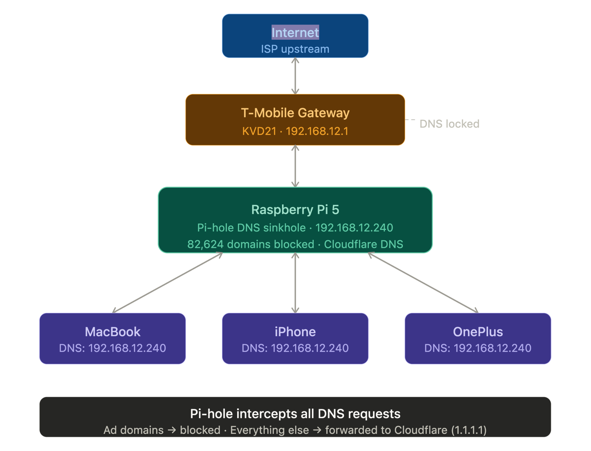
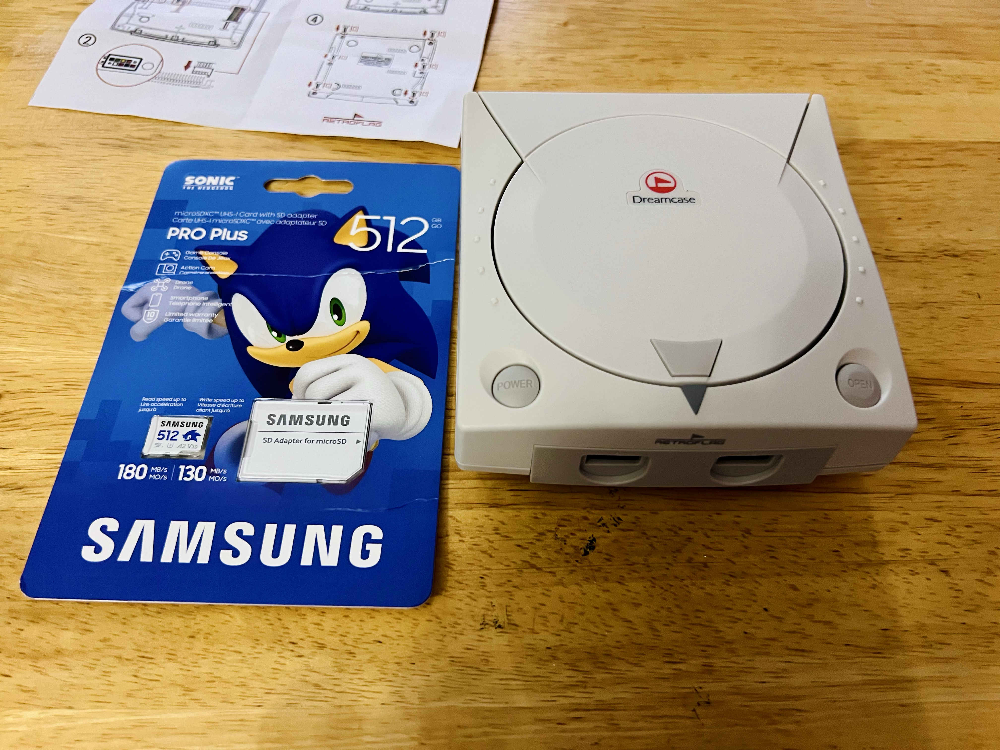
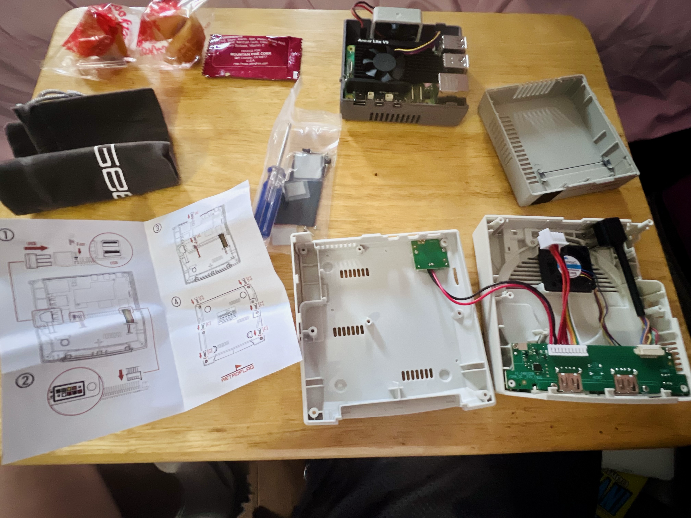
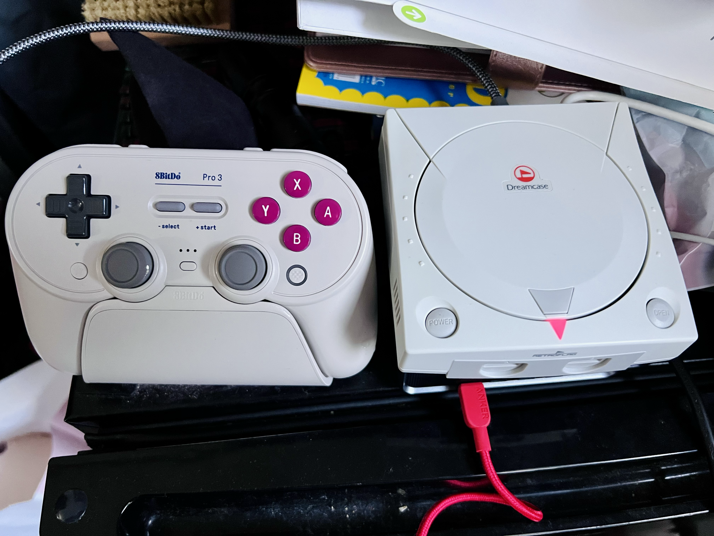
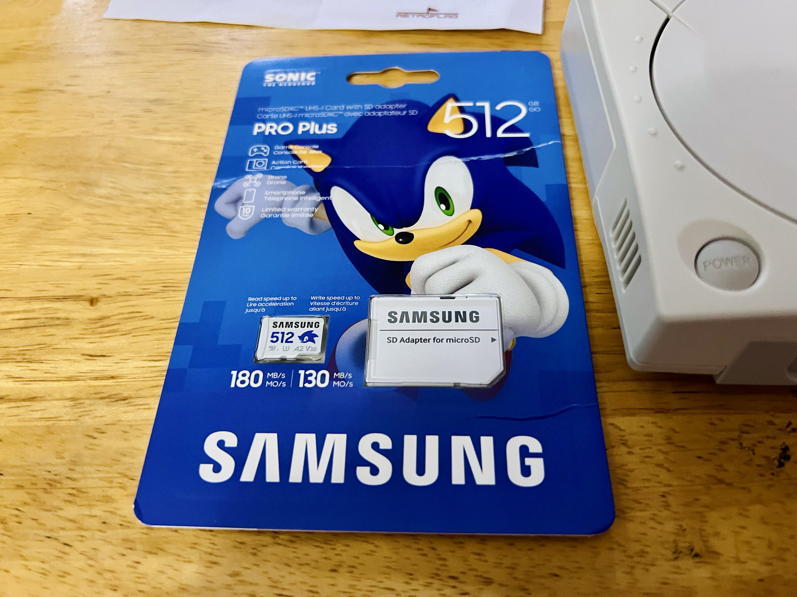

# Pi 5 Infrastructure Lab 🖥️

> "I trained engineers at Google, Microsoft, and LinkedIn — now I became one."

## Overview
Deployed a headless Raspberry Pi 5 server running Pi-hole DNS 
sinkhole, RetroPie emulation station, and Bluetooth controller 
support — all managed remotely via SSH from a MacBook. 
No monitor. No keyboard. Just terminal.

---

## Hardware
| Component | Details |
|---|---|
| Computer | Raspberry Pi 5 8GB |
| Case | GeeekPi Armor Lite V5 Active Cooler |
| Storage | SanDisk 256GB microSDXC |
| Power | CanaKit 45W USB-C |
| Display | 4K Micro HDMI to HDMI |
| Controller | 8BitDo Pro 3 (Bluetooth) |

---

## Software Stack
| Software | Purpose |
|---|---|
| Raspberry Pi OS Lite 64-bit | Headless Linux OS |
| Pi-hole v6.4.2 | Network-wide DNS sinkhole |
| Cloudflare DNS 1.1.1.1 | Upstream DNS resolver |
| RetroPie | Retro gaming emulation station |
| lr-flycast | Dreamcast emulator |
| bluetoothctl | Bluetooth controller pairing |

---

## What I Built

### 🔒 Pi-hole DNS Sinkhole
- Deployed Pi-hole to intercept all DNS requests on the network
- Configured Cloudflare 1.1.1.1 as upstream DNS resolver
- Blocked 82,624 domains network-wide (18%+ of all queries)
- All devices (MacBook, iPhone, OnePlus) route DNS through Pi

### 🖥️ Headless Server Management
- Flashed Raspberry Pi OS Lite via Raspberry Pi Imager
- Enabled SSH at flash time — zero monitor setup
- Remote access via SSH from MacBook at all times
- Static IP configured: 192.168.12.240

### 🎮 RetroPie Emulation Station
- Installed RetroPie on Raspberry Pi OS Legacy (Bookworm)
- Fixed Pi 5 kernel compatibility issue for Dreamcast emulation
- Added kernel=kernel8.img to force 4KB memory pages
- Transferred ROMs via SCP from MacBook to Pi
- Paired 8BitDo Pro 3 controller via bluetoothctl
- Running Sonic Adventure 2 at full speed on Samsung TV

---

## Network Architecture

---

## Live Demo

### RetroPie Running on Samsung TV

### Sonic Adventure 2 — Dreamcast on Pi 5

---

## Key Skills Demonstrated
- Linux server deployment and management
- SSH remote administration
- DNS configuration and network filtering
- File transfer via SCP
- Bluetooth device pairing via CLI
- Kernel configuration and troubleshooting
- Technical documentation (README, SOP, failures log)

---

## Project Files
| File | Description |
|---|---|
| README.md | Project overview and documentation |
| SOP.md | Step by step setup guides |
| failures.md | Errors encountered and how I fixed them |
| mock-it-tickets.md | IT troubleshooting scenarios |
| Network_Diagram.png | Home network architecture |

---

## Lessons Learned
- Pi 5 uses 16KB memory pages by default which breaks 
  certain emulators — fixed via kernel config
- T-Mobile gateway locks DNS — workaround via 
  Pi-hole on device level
- Always use Raspberry Pi OS Legacy (Bookworm) 
  for RetroPie compatibility, not Trixie

## Hardware Build

### Dreamcast Case + Sonic SD Card

### Pre-Build Setup

### 8BitDo Pro 3 Controller + Dreamcast Case

### Samsung PRO Plus 512GB — Sonic Edition

---

*Built by Jovi Cruz — IT Management student, 
Google IT Support cert in progress*  
*github.com/jovianney*
