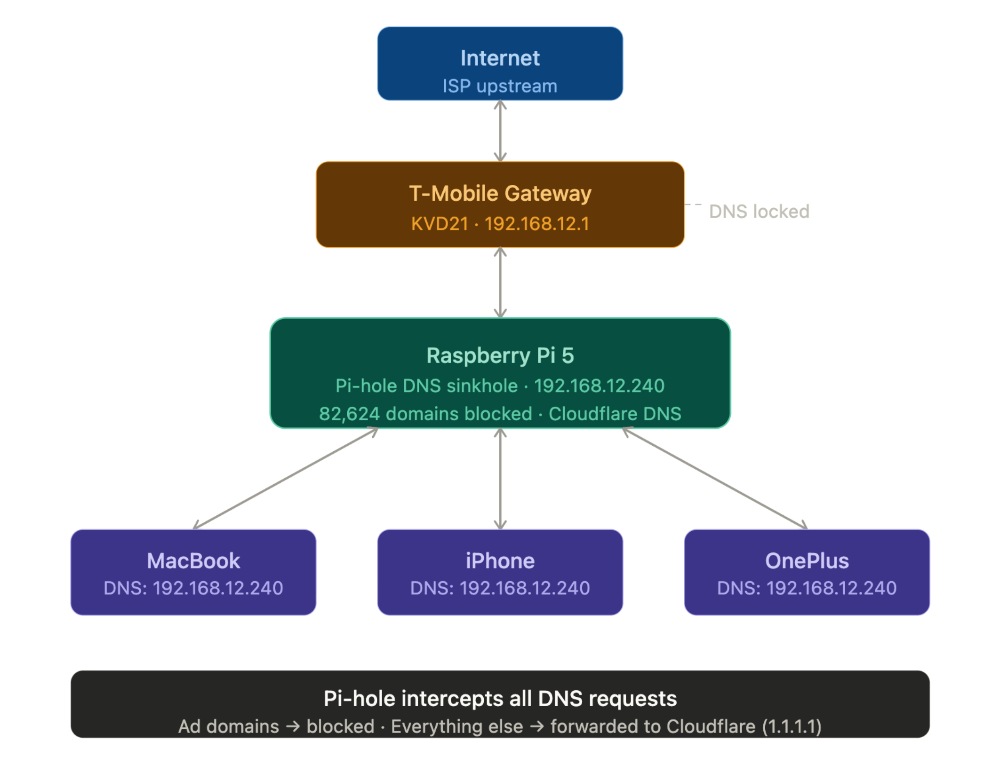

# Pi 5 Infrastructure Lab 🖥️

> "I trained engineers at Google, Microsoft, LinkedIn, Uber, ByteDance, VMware, and C3 — now I became one."

## Overview

A self-hosted homelab built on a headless Raspberry Pi 5 — DNS filtering, VPN mesh networking, redundant storage, containerized services, a self-hosted media stack, and portless public access via Cloudflare Tunnel, all managed remotely via SSH. No monitor, no keyboard, just a terminal and a growing stack of production services.

This repo covers the Linux/Pi side of a two-repo infrastructure portfolio. Windows Server, Active Directory, and enterprise domain work live in the companion repo: [windows-enterprise-lab](https://github.com/jovianney/windows-enterprise-lab).

---

## Hardware

| Component | Details |
|---|---|
| Computer | Raspberry Pi 5 (8GB) |
| Case | GeeekPi Dreamcast case with active cooler |
| Boot Storage | Samsung T7 1TB SSD — Pi boots directly from SSD, connected direct to the Pi's own USB port (not through a hub — see failures log) |
| Bulk Storage | 2x WD Elements 6TB drives, mirrored in RAID 1 via mdadm, mounted at `/mnt/wdelements` |
| USB Hub | SABRENT HB-BU10 10-port powered hub (RAID drives only — boot drive stays direct) |
| Power | CanaKit 45W USB-C |
| Networking | TP-Link TL-SG108E managed switch — VLAN segmentation (Work / IoT / Guest) |
| Camera | Reolink Lumus IP camera — static IP, RTSP stream, motion detection |
| Controller | 8BitDo Ultimate  (Bluetooth) |
| Display | 4K Micro HDMI to HDMI (setup only — runs headless day to day) |

---

## Network Identity

| | |
|---|---|
| Hostname | `retropi` |
| Local IP | `192.168.12.239` |
| Tailscale IP | `100.121.71.88` |
| Custom Domain | `jovis.casa` (via Cloudflare Tunnel) |
| SSH | `ssh jovi@retropi.local` (home network) or via Tailscale from anywhere |

---

## Software Stack

| Layer | Software |
|---|---|
| OS | Raspberry Pi OS Lite 64-bit |
| DNS | Pi-hole — 82,624+ domains blocked, Cloudflare 1.1.1.1 upstream |
| VPN | Tailscale — mesh network, MagicDNS |
| Firewall | UFW + Fail2ban |
| Containers | Docker + Docker Compose, managed via Portainer |
| Public Access | Cloudflare Zero Trust Tunnel — `jovis.casa`, zero open inbound ports |
| Storage | mdadm RAID 1, Samba, Nextcloud |
| Media | Jellyfin, Navidrome, Audiobookshelf, qBittorrent |
| Security | Vaultwarden (self-hosted Bitwarden-compatible password manager) |
| File Management | Filebrowser |
| Fitness | SparkyFitness (self-hosted nutrition tracker) |
| Automation | Bash, cron, self-healing monitoring script |
| Retro Gaming | RetroPie, lr-flycast (Dreamcast) |

---

## What I Built

### 🔒 Core Infrastructure
- Headless Pi 5 server, SSH-only management from day one
- Pi-hole DNS sinkhole blocking 18%+ of all network queries
- Tailscale VPN mesh — SSH and service access from anywhere, no port forwarding
- UFW + Fail2ban hardening against brute-force attacks

### 💾 Storage & Redundancy
- RAID 1 mirror across two 6TB drives via mdadm — survived a six-incident recovery saga (bootloader USB enumeration bugs, real filesystem corruption, stale fstab configs, stale Docker bind mounts) fully documented in the RAID project's failures log
- Samba NAS with role-based share permissions (Media / Backups / Documents)
- Nextcloud — private cloud storage, Docker + MariaDB
- Filebrowser — lightweight web UI for drag-and-drop RAID array management, no Samba mount required
- Automated nightly backup script (cron, 2am) covering configs and Docker volumes, with a documented 7-step disaster recovery plan

### 🎬 Self-Hosted Media Stack
- Jellyfin (movies/shows, sideloaded onto a Samsung TV), qBittorrent (categorized auto-routing), Navidrome (music), Audiobookshelf — all behind Portainer for centralized container management

### 🌐 Public Access
- Custom domain `jovis.casa` via Cloudflare Zero Trust Tunnel — every service gets a clean HTTPS subdomain with automatic SSL, zero open inbound ports on the home router
- 7+ published routes (Jellyfin, Vaultwarden, Nextcloud, qBittorrent, Portainer, SparkyFitness, Filebrowser)

### 🔐 Security
- Vaultwarden — self-hosted password manager, HTTPS end-to-end via Cloudflare Tunnel
- VLAN segmentation on a managed switch — isolated Work / IoT / Guest network segments
- Reolink IP camera with motion detection and automated alerts, remote viewing via Tailscale

### 🎮 Retro Gaming
- RetroPie on Raspberry Pi OS Legacy (Bookworm) — fixed Pi 5 kernel compatibility for Dreamcast emulation (forced 4KB memory pages)
- 8BitDo Pro 3 controller paired via `bluetoothctl`
- Sonic Adventure 2 running full speed on a Samsung TV

### 📚 Documentation & Practice
- IT Troubleshooting Playbook — living document, Problem → Diagnosis → Fix → Prevention format
- Mock IT ticket simulations (WiFi failures, slow laptops, account lockouts)
- Broken Lab Category — intentionally broke and recovered the system across multiple real scenarios (DNS outage, broken SSH config, full disk, service crash + systemd auto-restart, and the OMV incident that hijacked netplan and took down networking entirely)

### 💻 Coding
- Subnet CLI Tool (Node.js) — manual bitwise subnet calculator, no external libraries

---

## Network Architecture

---

## Key Skills Demonstrated

- Linux server deployment, hardening, and remote administration (SSH, UFW, Fail2ban)
- DNS configuration and network-wide ad/tracker filtering
- VPN mesh networking (Tailscale) and Zero Trust public tunneling (Cloudflare)
- RAID array design, live recovery, and multi-layer failure diagnosis (bootloader → filesystem → container runtime)
- Docker containerization and orchestration via docker-compose and Portainer
- Network segmentation (VLANs) on managed switch hardware
- Self-hosted service deployment: file storage, media, password management, nutrition tracking, file browsing
- Automated backup strategy and disaster recovery planning
- Bash scripting and cron-based automation
- JavaScript (Node.js) — networking logic built from scratch
- Technical documentation discipline: README, failures.md, SOP.md for every project

---

## Project Structure

| Folder | Description |
|---|---|
| `01-Pi-Setup/` | OS setup, SSH config, SOP |
| `02-Pi-hole/` | DNS sinkhole setup and screenshots |
| `03-RetroPie/` | Emulation station setup and screenshots |
| `04-Tailscale/` | VPN mesh networking setup |
| `05-UFW-Fail2ban/` | Firewall and brute-force hardening |
| `06-Security-Camera/` | IP camera, MotionEye, motion alerts |
| `07-IT-Playbook/` | Mock IT tickets and troubleshooting wiki |
| `08-Broken-Lab-Category/` | Intentional failure + recovery scenarios |
| `09-NAS-Samba/` | Network-attached storage, role-based shares |
| `10-Nextcloud/` | Self-hosted private cloud storage |
| `11-SparkyFitness/` | Self-hosted nutrition tracker |
| `12-Backup-Strategy/` | Automated backups + disaster recovery |
| `13-Portainer-Docker-Lab/` | Docker management GUI |
| `14-VLAN-Managed-Switch-Lab/` | Network segmentation |
| `15-Self-Hosted-Media-Stack/` | Jellyfin, Navidrome, Audiobookshelf, qBittorrent |
| `16-Vaultwarden-Password-Manager/` | Self-hosted password manager |
| `17-Cloudflare-Tunnel-Custom-Domain/` | Public HTTPS access, zero open ports |
| `18-RAID1-Redundant-Storage/` | Mirrored storage, six-incident recovery |
| `19-Automation-Scripts/` | Self-healing monitoring script |
| `20-Filebrowser-Web-File-Manager/` | Web UI for RAID array file management |
| `Network-Diagram/` | Home network architecture |
| `subnet-cli-tool/` | Standalone Node.js subnet calculator |

---

## Lessons Learned

*(Full breakdown per project in each folder's `failures.md` — these are the ones that shaped how I build everything since.)*

- **Boot drives never go through a USB hub** — the Pi's early-stage bootloader USB driver doesn't reliably enumerate storage through a hub, even a good powered one. Confirmed at the bootloader level during the RAID build.
- **OMV is permanently blacklisted** — took over netplan/systemd-networkd without warning, broke Tailscale and eth0, required full physical recovery. Any software that manages networking gets extreme caution now; Docker-based services have been safe throughout.
- **Never power-cycle mid-fsck or mid-resync** — interrupting disk-repair operations is what causes real corruption in the first place.
- **`latest` Docker tags are a liability** — pin to tested versions. Learned this the hard way when an ARM64-specific routing bug in Filebrowser's `latest` tag caused a broken login page.
- **UFW blocks everything by default** — every new service needs its own explicit `ufw allow` rule; it doesn't happen automatically just because Docker exposes a port.
- **NAT/MASQUERADE alone does not achieve network isolation** — requires an explicit `iptables FORWARD DROP` rule (learned in the Windows lab's virtual firewall build, applies everywhere).
- **Docker images are architecture-specific** — always verify arm64 vs amd64 before pulling.
- **SD cards wear out under constant read/write** — migrated OS boot to a Samsung T7 SSD for reliability, then learned SSDs have their own USB-enumeration quirks (see RAID lessons above).
- **Always keep a bootable SD card ready** as an emergency recovery fallback before any major install.

---

## Certifications & Education (In Progress)

- Google IT Support Professional Certificate
- CompTIA A+ → Network+ → Security+ (roadmap)
- BS in Business Administration, IT Management — CSU East Bay (online)

---

*Built by Jovi — 10 years in the fitness industry (Google, Microsoft, LinkedIn, Uber, ByteDance, VMware, C3), now building the infrastructure to back up the career transition into IT.*
*github.com/jovianney · jovis.casa*
