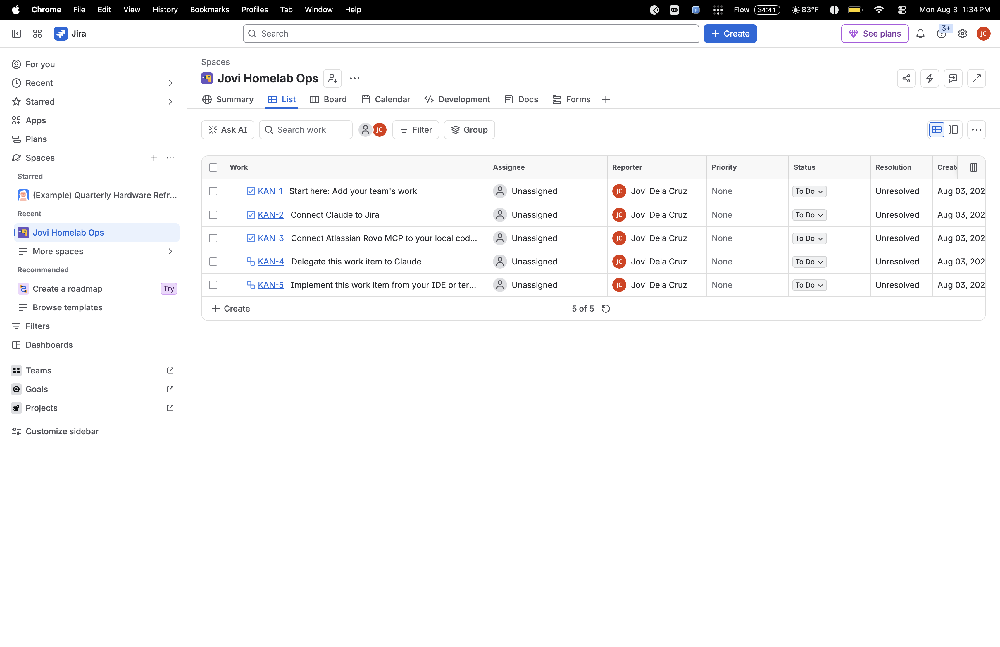
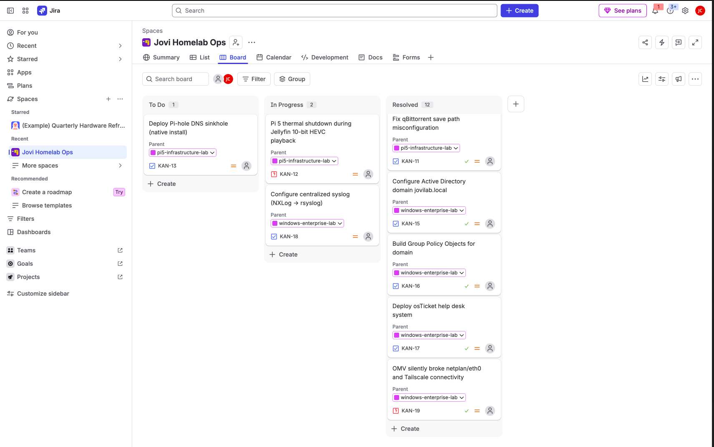

# Jira Cloud — Project Backlog & Kanban Board

## Problem

Job postings for Help Desk / IT Support roles consistently ask for "experience with ticketing systems" or "familiarity with Agile/Scrum." Rather than simulate this with a mock tool, I set up a real, free Jira Cloud instance and used it to track my actual homelab infrastructure work — turning completed projects and incidents into a real backlog with epics, tasks, and incident tickets.

## Solution

- Created a free Jira Cloud site (`jovianney.atlassian.net`) with a Kanban-style project, `Jovi Homelab Ops`
- Built two Epics to mirror my actual GitHub repos:
  - **pi5-infrastructure-lab** — Raspberry Pi 5 Linux homelab
  - **windows-enterprise-lab** — Windows Server/AD enterprise lab
- Populated the backlog with 12 real tickets pulled directly from documented project history (not placeholder tasks), including:
  - Deploy Raspberry Pi 5 headless server
  - Migrate storage to software RAID1 across dual 6TB drives
  - Configure Cloudflare Zero Trust Tunnel
  - Deploy Windows Server 2025 DC01 via UTM/QEMU
  - Configure Active Directory domain
  - Build Group Policy Objects
  - Two **Incident**-type tickets for real troubleshooting work (Pi 5 thermal shutdown root-cause, OMV network outage)
- Ran a working sprint cycle — moved tickets across **To Do → In Progress → Resolved** to reflect real project status
- Connected Claude directly to Jira via the Atlassian Rovo MCP integration to manage tickets, epics, and transitions programmatically

## Proof

**Board just initialized:**

**Final board — active backlog with real infrastructure tickets across all three stages:**

- 2 Epics (pi5-infrastructure-lab, windows-enterprise-lab)
- 12 real tickets tied to documented project work
- Mixed Task/Incident ticket types reflecting both build work and troubleshooting

**Resume line:**
> Managed a project backlog and sprint board in Jira Cloud, tracking real infrastructure projects end-to-end.
