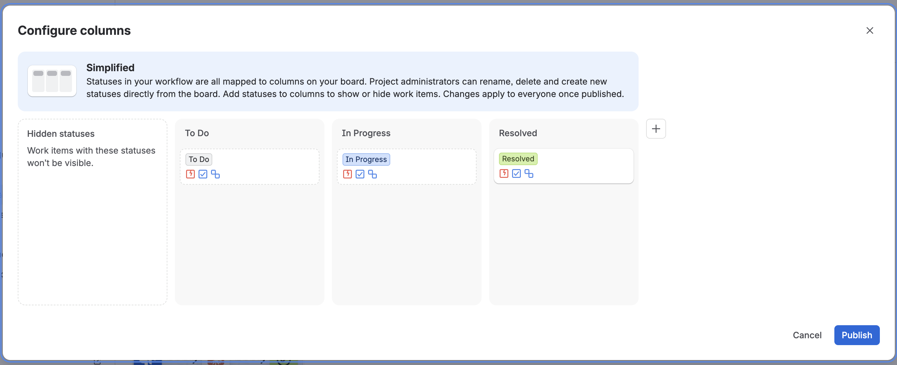
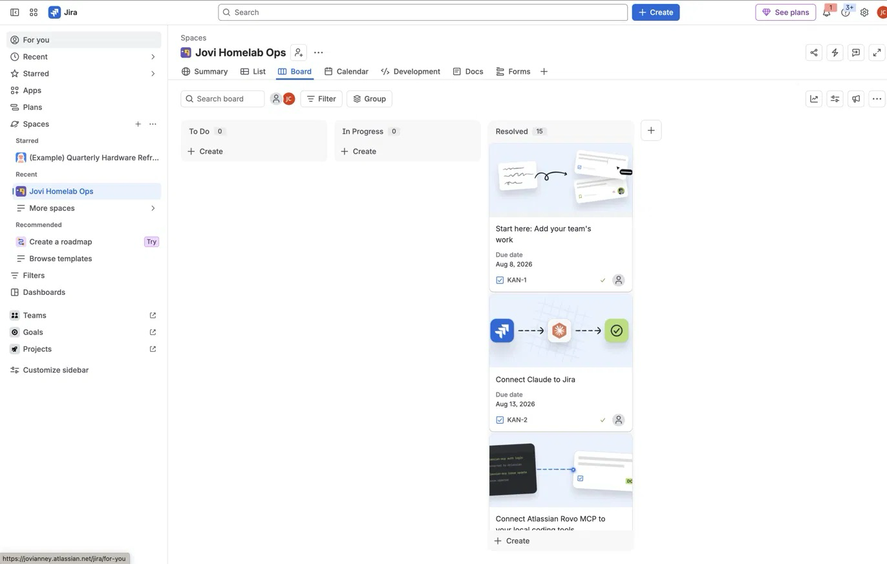

# failures.md — Jira Kanban Board

## Incident: Board workflow columns collapsed, all tickets showed as "Resolved"

**What happened:**
While cleaning up sample onboarding tickets, I attempted to delete unused board columns (To Do, In Progress) directly from the board view. Jira prompted for where to move the tickets inside those columns — the choice made there didn't just move cards visually, it rewrote the underlying **status field** on every ticket in those columns. The result: the "To Do" and "In Progress" statuses were removed from the workflow entirely, and all 15 tickets on the board collapsed into a single "Resolved" column.

**Initial assumption:**
That data had been deleted.

**What was actually true:**
No tickets were lost. Verified via direct API query (`searchJiraIssuesUsingJql`) that all 19 issues still existed in the project — only their `status` field had been bulk-changed to "Resolved" as a side effect of the column deletion, and the "To Do" / "In Progress" statuses no longer existed in the workflow to transition back into.

**Root cause:**
Deleting a board column in Jira's simplified workflow view doesn't just hide it — it can permanently remove the associated status from the workflow if not handled carefully, silently rewriting the status of every ticket that was in it.

**Fix:**
1. Opened **Board Settings → Configure columns**
2. Recreated the missing statuses (`To Do`, `In Progress`) and mapped each to its own column
3. Reordered columns to read left-to-right in the correct workflow sequence: To Do → In Progress → Resolved
4. Published the change
5. Used the Jira API to re-transition the affected tickets (KAN-12, KAN-13, KAN-18) back into their correct statuses now that the workflow states existed again

**Lesson learned:**
On a Jira Kanban board, deleting a column is a workflow-level change, not a display-level change. Before removing a column, check whether its status is safe to retire — moving tickets to another column via "reassign issues to" during a column delete can permanently overwrite their real status field. Always verify via a direct data query (not just the board view) before assuming anything was lost.
